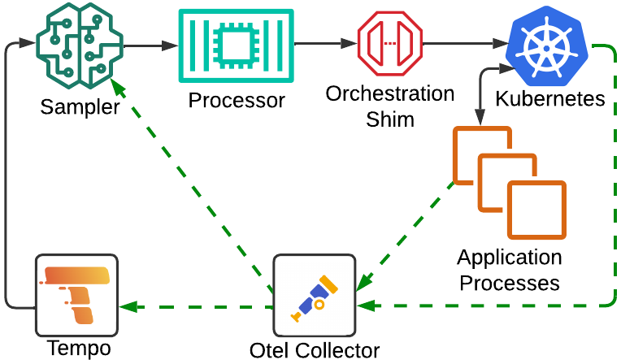
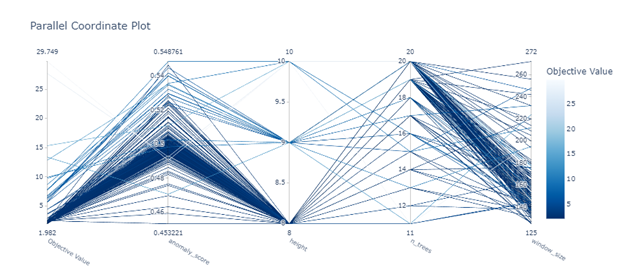

1 Introduction
==============

Whether running workloads on remote cloud or on-premises clusters or compute grids, one of the 
most significant factors that can affect operational expense and capital expenditures is proper
resource utilization.  On one side of the spectrum, if you are under-utilizing resources, wasted cost
is obvious in the form of unused hardware and network allocation.  On the other side of the spectrum, 
if you are over-utilizing resources, this can negatively impact response times causing degradation and
failure throughout your application.  At a minimum, this can frustrate your client base,
while in severe cases cause detrimental production outages, leading to possible irreparable damage to your
company or brand.

To combat this, software delivery teams are starting to lean heavily on dynamic workload scaling.  This allows
them to utilize resources efficiently and as needed.  For full scale cloud workloads, this promotes requesting
the optimal amount of resources at any given time, maximizing system throughput when service requests are at their peak
and relinquishing those resources during periods of low traffic.  For on-premises, while the capital expense of buying 
hardware cannot be unwound, there is still benefit as you can properly scale varying workloads throughout different
periods to better share resources across internal development teams and business units.

While technologies exist to varied degrees to support dynamic load scaling, current implementations seem
to have their limits.  Many are focused directly on hardware resources such as CPU and memory.  If the CPU
utilization breaches a certain barrier, then new instances of some computational unit will be spun up.  Some
take a step deeper and will rely on application generated metrics, although there is a direct overhead in
instrumenting the right parts of your application, and making scalers aware of and correlating the correct application
metrics to the right scaling actions.

These metrics are often analyzed and applied in different ways.  Engines can take a manual heuristics based approach,
where operators will often define a set of scaling rules and thresholds based on a working knowledge of the system.
Other systems opt to take an automated approach, usually drawing on some form of machine learning to
make scaling decisions.  The novelty of these systems usually stems in the specific machine learning techniques
and models that are utilized.  Lastly, while not all, a vast portion of autoscalers are tied directly to a specific
operational environments.  Very often this stems from being tied to a specific cloud vendor, such as AWS or GCP. Cloud vendor agnostic
scalers are likely to be tied to a single orchestration system, with Kubernetes being the most common case. 

We submit that there is significant novelty in a system which makes use of distributed tracing data to make intelligent
decisions based on application performance directly as opposed to simple metrics based autoscaling implementations.
We believe that it should be designed in such a way that is not tied to any specific decision-making mechanism or orchestration technology.
Instead the implementation should provide abstraction around these two general areas.  The system should instead
focus on the need to separate interesting vs. benign trace data.  Such a design would allow research to
key in on the area of anomaly detection in trace data.  This would allow operators to tailor scaling to diverse and heterogeneous architectures.
Through our research, we will make a case for SCALE, a system which emphasizes the sampling of distributed tracing for anomalous execution duration.
In such cases that anomalies are detected, the processor will generate scaling signals based on the analysis of tail latencies of individual calls within those graphs.

2 Background & Characterization
===============================

## 2.1 Related Works

In our research, we drew particular motivation from gaps in the current state of the art of autoscaling systems pointed out
by our fellow researchers.  Much of this fell in line with our vision, and helped reinforce the direction we took in our
own implementation.

### 2.1.1 Autoscaling

Straesser et al. @whysolve22 argue that most state-of-art autoscalers are difficult to implement in production because they are often too complex. Moreover, they often rely on traditional platform metrics, for example CPU based scaling. There are applications where the performance profile is not CPU or memory dominated. In those cases, there is an advantage in scaling based on the combination of both platform and application metrics. Additionally, there is a notable lack of generic, general-purpose autoscalers to address these needs. 
 
Eder et al. @comdist23 highlight that one important factor which should be considered is the resulting cost of its deployment, especially when it comes to deploying in a pay-per-use billing model. In addition, it is essential that distributed tracing does not significantly degrade application performance. Eder et al. compare serverless applications executing with and without tracing. They observed the performance impact - measured in terms of runtime, memory usage, and initialization duration varied across the tools analyzed (Zipkin @zipkin24, Otel @otel24, and SkyWalking @skywalking24). They conclude that with appropriate tool selection, the advantages of distributed tracing can be maximized while minimizing performance drawbacks. 

Yu et al. @microscaler19 proposed _MicroScaler_ which aims to identify the services in need of scaling to meet SLA requirements.  _MicroScaler_ achieves this by collecting service metrics (i.e. QoS, latency) in service mesh enabled architectures by injecting proxy sidecars alongside each microservice application. Although this method is novel, it makes scaling decisions solely based on latency and adds the overhead of sidecars to collect the metrics. 
 
This is not to say that all autoscaling decisions are based on simple approaches like monitoring CPU, memory, or latency. A study done by Thanh-Tung et al. @hpa20, in which the authors use Prometheus Custom Metrics (PCM) to collect HTTP request metrics. The collected metrics are then compared against Kubernetes Resource Metrics (KRM) and its impact on Horizontal Pod Autoscaler (HPA) in Kubernetes is analyzed. The authors note that using metrics obtained from PCM increases the effectiveness of HPA but falls short in mentioning how PCM can be used to identify resources which might be a potential candidate for autoscaling. 

### 2.1.2 Sampling

Modern distributed applications are inherently complex, often requiring detailed insights into the orchestration of individual requests as they traverse various services. Distributed tracing addresses this need by providing a granular view of request flows. However, the resulting trace data can be voluminous—reaching terabytes per day in live production environments—leading to significant challenges in downstream processing and storage. To mitigate these issues, sampling has emerged as a critical technique for maintaining system efficiency while managing data overload.
 
The most common sampling strategy, employed by tools such as Jaeger @jaeger24 and Zipkin @zipkin24, is uniform random sampling, also referred to as head-based sampling. In this method, sampling decisions are made at the initiation of a trace. While straightforward, head-based sampling often captures redundant traces representing common-case execution paths, providing limited value for diagnosing anomalies or rare events.
 
To address these limitations, tail-based sampling, also known as bias-based sampling, defers the sampling decision until a trace has been fully collected. This approach prioritizes traces that are more likely to be informative or anomalous. Tail-based sampling has been widely adopted in both academia and industry. For instance, _Tracemesh_ @tracemesh24 employs _DenStream_ @denstream06 for clustering streaming data, leveraging evolving clusters to sample traces based on their high dimensionality and dynamic characteristics, thereby reducing oversampling. Similarly, _Sieve_ @sieve21 implements a biased sampling mechanism that adjusts probabilities based on attention scores, using Robust Random Cut Forests (RRCF) to detect uncommon traces. Both _Tracemesh_ and _Sieve_ utilize structural and temporal variations in traces to improve sampling effectiveness. Additionally, _Sifter_ @sifter19 prioritizes diverse traces by weighting sampling decisions towards those underrepresented in its model, enhancing trace variety. Las-Casas et al. @weighted18 proposed a weighted sampling approach based on execution graph clustering, employing a hierarchical clustering method called Purity Enhancing Rotations for Cluster Hierarchies (_PERCH_) to ensure diversity in selected traces.
 
Other approaches have further advanced trace sampling methodologies. _STEAM_ @steam23 addresses the challenge of information loss inherent in long-tail distributions of traces by combining Graph Neural Networks (GNNs) for trace representation with fast Determinantal Point Processes (fastDPP) for sampling. _STEAM_ also incorporates domain knowledge through logical clauses to enhance trace comparisons. _TraStrainer_ @trastrainer24, introduced by Huang et al., integrates system runtime states and trace diversity to guide sampling preferences. It employs a dynamic voting mechanism to optimize final sampling decisions, offering a more holistic approach to trace selection.

## 2.2 Distributed Tracing vs. System Level Metrics

```{=latex}
\begin{figure}[t]
  \includegraphics[width=\linewidth]{img/trace-scale-example.png}
  \caption{Sample Scalable Architecture}
  \label{sample_arch}
\end{figure}
```

It is our intention to describe an application architecture where one could apply several strategies for autoscaling based on performance based observability data. This could be via a heuristics based or automated (i.e. machine learning) approach. The observability data could come from a number of sources including log data, distributed traces, application or process orchestrator metrics. We will then provide the reader with some example scenarios that could induce actions from an autoscaler. Our examples do not seek to argue the merits of one processing approach over the other.			

The examples instead portend to show a benefit in utilizing distributed tracing data for driving autoscaling decisions. We approach this from the lens that current state of the art autoscalers rely for the most part upon process orchestrator metrics to drive their scaling. The aforementioned metrics are often confined to physical resources such as CPU or memory utilization, and in some cases IO throughput degradation. We present the reader with a sample architecture in Figure 1 that shall allow us to describe instances where distributed traces would likely provide more robust scaling decisions versus system metrics based counterparts.

Let’s start with two separate microservices, Service A and Service B. While the various details of their upstream clients are of little concern to the example, we do focus on one important characteristic for each. The first is that clients to Service A typically send very large payloads in their requests (let us say 5MB on average). The second is that clients to Service B have extremely tight SLOs (let us say 500ms). Both services may do some arbitrary processing on the payloads, which for the example let us assume takes negligible time, and then sends some portion of that processing to the same endpoint of an API gateway. The API gateway then forwards these to a distributed queue to be further processed by a set of serverless workers. The main task of the serverless workers is to provide some validation of each payload and finally persist it into an arbitrary data store. We shall examine two scenarios, both which stem from slow processing by the serverless functions. Autoscalers using typical orchestration or system level metrics could easily, under certain scenarios, be lead to take misguided scaling actions.			

In the first scenario, let us conceptualize that persistence under optimal circumstances takes on average 100ms. In this scenario, let us imagine that we have capped ourselves to 100 serverless instances. At some point during the system’s operation, the system experiences a spike in traffic and begins to see more than 1000 requests per second total between the two microservices to the API gateway. As we only have 100 instances, and it takes 100ms on average per request for a serverless function to handle a request, we will begin to see a backup in the queue. As this back pressures all the way to the microservices we can envision multiple effects. Service A will begin to ramp up in memory usage as it has to buffer large payloads. Service B will begin to miss SLOs, likely resulting in timeouts if they are configured. This could result in a spike in CPU as clients continually attempt retries, and these attempts begin to cumulate alongside legitimate new requests.

The question then is, how would a system level metrics scaler react. It may see that memory is ramping on Service A and begin to vertically scale to more memory for the service. It may see that CPU has spiked on Service B and vertically scale the service. Furthermore, it may see that connections to Service B are stacking due to the timeouts and horizontally scale B. Depending on buffering and back pressure semantics in the API gateway, this scaling could also cascade to the gateway as well. If we could examine a complete distributed trace from Service A or Service B all the way through to persistence, it would be clear the bottleneck is with the serverless functions. From there one can further observe that the functions themselves do not have high latency in processing nor in persistence. A scaling system can then make the correct judgment that it is just the cap on our serverless instances and scale those horizontally.
					
One can make a simple counterargument to the above, in that we could simply monitor a metric that represents how many requests are sitting in the distributed queue. If the queue is backed up by some fixed amount, we too can scale. The issue with this approach is that it only provides insight into the latency of the serverless function itself. Is the real issue that some piece of code is running slow due to intense computation or is the function waiting in some blocking IO operation? To further this argument, let us envision a scenario in which database transactions are stacking up, and the database cannot process them all in a timely manner. By utilizing a queue size metric, we simply would have scaled the serverless functions out. This in turn would only serve to further degrade the database. If we were to view a full trace, and we had a trace span directly around the call to the database, we would know the problem is the database itself and can properly scale database resources.
					
The above examples are not meant to completely discredit analysis of system and infrastructure based metrics as a driver for autoscaling decisions and solutions. Their purpose is to show the practicality of leveraging distributed tracing to paint a broader canvas of the health and operation of a distributed system. Well-placed metrics alone could theoretically be pieced together to achieve the same insights as the aforementioned examples. However, this would require very intimate knowledge of your entire dependency graph and for these relationships to be maintained in your monitoring rule set. For smaller systems this may be feasible, but for real-world distributed systems which are composed of hundreds of different services and supporting infrastructure this is untenable. Distributed tracing carries service dependency graphs inherently and so system designers and monitoring software to dynamically introspect dependencies, allowing them to easily adapt over time.
		
## 2.3 Human Insight vs. Machine Learning

When surveying the landscape of current autoscaling systems available, one of the more significant choices that arises is whether to take a heuristics based approach or whether to use a fully automated approach.  Many original scaling systems were based off of Heuristics.  It is of course easier to implement a simple rules based parser than to design a fully automated system.  This allows you to make use of common domain knowledge and directly apply scaling semantics that you think best serve the health of your system.  This of course has some obvious drawbacks.  The most important of these is the constant human intervention.  You will no doubt have to spend well focused man-hours devising your scaling rule set and then whatever time it takes to put pen to paper.  This is also not a one-off cost.  As your system changes over time either due to planned architecture changes or unforeseen circumstances, you will constantly need to rework your scaling model.  Looking past the manual overhead this approach brings, there is also the fact that humans are not infallible, and any scheme they come up with, while hopefully sound, is quite unlikely to be fully optimal.

Several of the more current papers we researched opt to take some form of automated approach.  As AI and ML are the hottest subjects in computer science both academically and in industry, this direction is inevitably explored at great length.  Typically, the major differences in these papers is around what machine learning techniques to use.  Some systems, such as _FIRM_ @firm20 and _AWARE_ @aware23, take a reactive approach, often leveraging reinforcement learning.  In this approach, a sort of feedback loop of learning is used, where each scaling action results in a new environmental state and rewards are assigned to each transition to determine if a more optimal state was obtained.  As time progresses, the system can take actions based on prior rewards that are more likely to transition to the most optimal state.

Other systems take a more proactive approach. For instance, _Madu_ @powpred22 uses regression techniques backed by TensorFlow[^tensorflow] to generate predictive models that can sense load before or as it is ramping up to attempt to prevent degradation before it happens.  While both of these approaches address the prior issue of added human overhead through automation, they still cannot truly guarantee optimal scaled state at all times.  What's more is that ML based solutions often introduce a great deal more complexity due the extra components they often require, as well as the overhead of initial model training plus retraining to cope with systematic change.

[^tensorflow]: [https://www.tensorflow.org/](https://www.tensorflow.org/)

This finally brings us to the choice, should we use the insightful approach or the machine learning approach when both analyzing observability data and making scaling decisions within SCALE.  Indeed, many highly effective state of the art autoscalers take a heuristics based approach, and as stated most new research seeks to justify moving to an ML based framework.  Yet, there is no concrete evidence that one is an order of magnitude better than the other.  In fact, one of the most compelling works we read @needed23, takes this head on.  In their paper, they present a strong argument that the most effective system makes use of both, and ML only approaches typically only provide a shifted version of the original training data.  Even certain ML based solutions make at least in part some use of human insight, such as _AWARE_ @aware23 which utilizes a heuristics approach in its offline training mode.  Taking all of this into account, this inspired us to use a hybrid approach with SCALE, in which we use machine learning to sample for anomalies and a heuristics based approach for performing strict analysis and decision making. 


3 SCALE Design
==============

## 3.1 Overview

In agreement with the statements and observations outlined in §1 and §2, we introduce SCALE, a software system which analyzes various system and application generated
observability data in order to perform dynamic scaling of application work loads in cloud hosted and/or on-premises environments.
We envision a monitor that can make use of open technologies to probe distributed tracing and metric data.  This system would wire up to client APIs of a diverse set of process orchestration software. This can include container orchestrators, serverless function controllers or VM provisioning frameworks amongst others.  Based on processing of the observability data, a processor will make
vertical or horizontal scaling decisions.  These decisions will then be communicated to the orchestration systems via their 
client API to carry out the scaling action.

We are proposing a more adaptable solution than the current state of the art.  One that works well with 
multiple open source technologies as well as proprietary cloud APIs, thus making
it more portable across different cloud providers or on-premises orchestration platforms.  Most development teams today instrument their applications in some form for distributed tracing, metrics collection or both.  In addition, orchestration platforms,
web and network proxies and virtualization systems expose a myriad of system level metrics.
These all amount to data points which can be used for real time monitoring, trend research and performance analysis.
However, these same data points could in turn be analyzed, and when combined with a rich set of thresholds and rules provided by development or operational teams, or by automation and machine learning, be the driver behind dynamic resource scaling.

While we aim for extensibility, the true novelty of our research hinges on the viability of making scaling decisions 
based on distributed tracing data.  Hence, our implementation will directly focus on the consumption, sampling and analysis of traces.
The analysis centers around a heuristics based trace processor which will check trace spans for latency breaches above configured
thresholds.  Based on actions attached to those thresholds, when breached, the processor will initiate scaling directives via a shim
that sits atop of the Kubernetes API.

## 3.2 Architecture



Figure \ref{scale_arch} represents the core architecture of SCALE.  The three major components which make up SCALE itself are the *sampler*, *processor*, and *orchestration shim*.  These components work together to form a cohesive, modular workload scaler.  

The components are built as implementations upon abstractions allowing for future adoption of other sampling algorithms, decision-making models or orchestration technologies.  SCALE is also dependent upon a distributed trace storage mechanism
and a distributed trace delivery mechanism. For these we use Grafana Tempo and OTEL Collector respectively.  Much
of the communication between components happens over a protocol standard for distributed traces known as OTLP.

### 3.2.1 OpenTelemetry & OTLP

The fundamental component of the SCALE workflow is a distributed trace.  The most common state of the art way to model distributed traces is via
OpenTelemetry[^otel].  _OpenTelemetry is a collection of APIs, SDKs, and tools. It is used to instrument, generate, collect, and export telemetry data (metrics, logs, and traces) to help you analyze your software’s performance and behavior @otel24\._ OpenTelemetry provides a uniform data schema for modeling distributed traces as well as serialization in JSON or protocol buffers.  Traces are modeled conceptually as a hierarchy within a DAG.  Each measured operation of a distributed trace is referred to as a span.  A trace is provided with a unique trace id.  All spans share this trace id, and in addition contain their own span id.  Each span also holds the span id of it's parent (unless it is the root span), the start and end timestamp of the span, as well as other various metadata. 

[^otel]: [https://opentelemetry.io/](https://opentelemetry.io/)

In addition to the schema model, a protocol for sending and receiving traces is provided.  This protocol is known colloquially as OTLP and is offered over either HTTP REST or gRPC transport.  SCALE as well as it's supporting components make direct use of both the protocol buffer schema as well as the OTLP gRPC transport.  This allows us to model and pass telemetry data throughout the system in a uniform manner, as well as not tying SCALE directly to any specific supporting component.

### 3.2.2 Collector & Tempo

In addition to OTLP and its accompanying schema, OpenTelemetry provides Collector[^otelcol], a _vendor-agnostic way to receive, process and export telemetry data @otel24\._   In SCALE's case it allows us to build a pipeline for distributed traces.  The source of these traces can be either applications or infrastructure.  In the case of SCALE it would be microservices or batch jobs running in Kubernetes.  In addition, Kubernetes components directly support emitting traces giving you insight into  performance of the kubernetes API and kubelets.  Collector can be extended to receive traces from sources other than those supporting OTLP, and in fact it currently has support for dozens of other ingestion mechanisms.  Thus, while SCALE itself is implemented over OTLP, upstream distributed traces can be generated via a number of different methods.

[^otelcol]: [https://opentelemetry.io/docs/collector/](https://opentelemetry.io/docs/collector/)

As traces are sent into Collector, they are then in turn sent downstream to multiple components in the SCALE environment.  One of those components is Grafana Tempo[^tempo], 
_an open source, easy-to-use, and high-scale distributed tracing backend @tempo24\._  Tempo facilitates storing and querying of distributed tracing data.  In the case of SCALE, the storage backend configured for Tempo is local disk, however in large scale production environments this can be made to point to various object stores such as S3 or GCS.  The flow of data from applications and Kubernetes, to Collector, and ultimately to Tempo can be seen in figure \ref{scale_arch}, represented by the green dashed lines.  There is one additional line in this workflow, to the sampler, which we describe next.

[^tempo]: [https://grafana.com/oss/tempo/](https://grafana.com/oss/tempo/)

### 3.2.3 Sampler

The sampler is the first direct SCALE component within the architecture's overall pipeline.  The job of the sampler is to sample trace spans for anomalies before they are sent downstream for scaling determination.  This allows SCALE to predetermine interesting traces in a fast manner, so that extra resources are not wasted on a deep analysis of the call graph.  Downstream the SCALE processor relies on a heuristics based examination of traces.  However, there is a non-insignificant overhead involved in analyzing large call graphs that should be avoided if possible.  This would be further exacerbated if the processor (described in §3.2.4) were swapped for an implementation that relied on a more compute intensive approach. 

At it's core the main purpose of the sampler is to identify trace spans that have unusual durations.  Many of the researched works attempt to perform a holistic sampling of distributed traces.  This is often to identify anomalies in both newly seen call graphs in addition to call durations.  In our case we are only interested in anomalies in the duration of calls.  Given this our sampling is performed directly on each span individually.  This leads to both a more deterministic and more performant implementation.

Spans in open telemetry contain four distinct attributes that are important to our sampling.  The first of these two are the service name and operation name.  The service name is taken to mean a collection of instances of a specific service as opposed to a single running instance.  The operation name denotes a specific unit of execution within a service.  Together these help us to uniquely identify very specific call points within a distributed system for classification.  The second of the two attributes are start and end time in nanoseconds since Unix epoch.  These allow us to determine the duration of the span.

```{=latex}
Each span \( S \) is thus characterized by:
\begin{itemize}
    \item \textbf{Service name:} \( s \)
    \item \textbf{Operation name:} \( o \)
    \item \textbf{Start time:} \( t_{\text{start}} \)
    \item \textbf{End time:} \( t_{\text{end}} \)
\end{itemize}

The \textbf{Duration} \( D \) of a span is computed as:
\begin{equation}
D = t_{\text{end}} - t_{\text{start}}
\end{equation}
```

The sampler uses Half-Space-Trees (HS-Tree) @hst11 to perform anomaly detection on the durations of spans.  An online variant of isolation forests, HS-Tree provides a model for fast one-class anomaly detection within evolving data streams.  With HS-Tree you provide bounds on the data space which features can fall within.  Multiple trees are then formed based on whether features fall within one half of the bound or the other, with different trees holding different orderings of features.  All trees are sampled, and a prediction is formed from a consensus of the results from all trees.  HS-Tree is best suited for cases where anomalies are rare which is the expectation in distributed trace data.  The HS-Tree model isolates anomalies based on isolation depth _h_, producing an anomaly score:

```{=latex}
\begin{equation}
\text{Anomaly Score} = 2^{\frac{-h}{H}}
\end{equation}
where:
\[
\text{H} = \text{maximum tree height}
\]
```

A number of proven open source implementations exist, and for SCALE we chose to go with from River[^river] an online machine learning library for Python.

[^river]: [https://riverml.xyz/dev/](https://riverml.xyz/dev/)

To categorize the service and operation name we use one-hot encoding.  The river HS-Tree implementation is able to accept a sparse python dictionary that does not contain
the entire feature set of your data space.  Given this, we simply use simple numerically increasing integers as keys for the feature name of the service and operation.

```{=latex}
Each span is represented by the following feature set (where \textit{OneHotEncode} is defined in \textbf{Algorithm \ref {alg:one_hot_encode}}):
\begin{equation}
\mathbf{X} = \{ \text{OneHotEncode}(s, o), D \}
\end{equation}
\begin{algorithm}
\caption{One-Hot Encoding Function}
\label{alg:one_hot_encode}
\begin{algorithmic}[1]
    \STATE Initialize an empty dictionary \texttt{encodings}
    \STATE \textbf{Function} \texttt{OneHotEncode}(service, operation)
    \STATE $call\_name \gets service + "::" + operation$
    \STATE $encoding \gets encodings.\texttt{get}(call\_name)$
    \IF{$encoding$ is \texttt{None}}
        \STATE $encoding \gets \texttt{len}(encodings)$
        \STATE $encodings[service] \gets encoding$
    \ENDIF
    \STATE $record \gets \{ \texttt{str}(encoding) : 1 \}$
    \RETURN $record$
    \STATE \textbf{End Function}
\end{algorithmic}
\end{algorithm}
```


We then take the difference of the end timestamp minus start timestamp and scale these to milliseconds.  This is added as a second feature to the record and passed into the River HS-Tree model for sampling.  To initially train the HS-Tree model, a pre-configured set of traces are queried from Tempo via an HTTP REST service which provides traces in OpenTelemetry protocol buffer format.  The traces are stored in a pandas data frame as they are collected.  When all traces have been pulled, the model is trained which each span featurized as per the above described algorithm.  The sampler has six core parameters which are used to calibrate the model prior to training:

```{=latex}
\begin{table}[H]
  \caption{Sampler Parameters}
  \begin{tabularx}{\columnwidth}{l|p{5.5cm}}
    \hline
    Parameter                 & Description \\
    \hline
    n\_tree                   & number of HS-Trees \\
    height                    & height of each HS-Tree \\
    window\_size              & observations in each HS-Tree node \\
    min\_score                & minimum score required for sampling \\
    max\_duration             & maximum bound for duration feature \\
    train\_size               & number of spans to train the model\\
    \hline
  \end{tabularx}
  \label{table: sampler_parameters}
\end{table}
```

After the model has been successfully trained according to the parameters, the sampler starts a gRPC listener which exposes two RPCs.  The first is an implementation of the OTLP gRPC interface for receiving traces.  As shown in figure \ref{scale_arch}, this allows Collector to stream new traces into the sampler as they are received from upstream applications and infrastructure.  The second RPC provides a streaming endpoint which clients can connect to in order to receive sampled spans, which are provided to the client in their entirety as they were received from Collector.  These together along with the core sampler logic essentially form a streaming pipeline of spans, with the OTLP endpoint as the source, the sampler logic as a filter and the client endpoint as a sink.

### 3.2.4 Processor

As described, the processor serves as a downstream component of the sampler within the SCALE architecture.  It is the task of the processor to analyze traces and make the ultimate decision on whether to perform any scaling operations.  The processor is configured with a set of rules defined via YAML configuration.  These rules associate latency thresholds with scaling actions.  An example of this is of the form _scale service A if operation B reaches a latency of X, N times within a given window._  The rules then drive the heuristics based analysis of the distributed traces received from the sampler.  

```{=latex}
Scaling actions are triggered when specific thresholds are exceeded:
\begin{equation}
\text{Action} \iff \text{Count}(D > T, \text{window}) \geq N
\end{equation}
The system distinguishes between load bottlenecks and resource constraints, applying appropriate scaling decisions:
\begin{equation}
\text{Scale}(s, o) = 
\begin{cases} 
\text{Horizontal}, & \text{if load bottleneck} \\ 
\text{Vertical}, & \text{if resource bound} 
\end{cases}
\end{equation}
```

The processor is composed of two main components, the consumer and processor engine.  The consumer will initiate a streaming gRPC connection to receive the sampled spans using the Python asyncio version of gRPC.  The spans received contain all of the same attributes and metadata that were also received by the sampler.  These spans are somewhat hierarchical, but not organized according to traces, and more so to shared data between spans for compaction purposes.  The spans are then dropped into an asyncio queue.  

The processor engine will then read these spans from the queue.  The spans are iterated over and flattened into a pandas dataframe.  The rule set defined in the configuration file is then applied as precompiled predicates against the dataframe.  Any rules whose criteria is a match has their actions folded into a conflated action set.  The purpose of conflation is to deduplicate redundant scaling actions.  When the analysis is complete the processor will then call the Kubernetes shim to perform the scaling action.  In addition to scaling analysis and actions, the processor engine will also continually keep several statistics and trend analytics of inspected spans.

### 3.2.5 Orchestration Shim

The orchestration shim acts as a layer between the processor and Kubernetes itself.  Its purpose is to abstract away the specific details of the Kubernetes API, in order to provide a more generic scaling interface to the processor.  This abstraction model allows for the ability to swap out service orchestration backends, or more realistically to compose multiple backends.  This is manifested in the form of an OrchestrationClient interface which provides a stub for scaling a resource, and another for getting the current scale of a resource.  The shim is meant to be intentionally light weight, and implementations are called directly within the processor.

```{=latex}
\begin{figure}[t]
  \includegraphics[width=\linewidth]{img/scale-flow.png}
  \caption{SCALE Workflow}
  \label{scale_flow}
\end{figure}
```

## 3.3 Performance and Overhead

In an autoscaling system which is reacting in real time to a constant influx of observability data, one must take into 
careful consideration how that system itself is performing.  First and foremost it cannot be a detriment to the system
it is monitoring and making scaling decisions for.  Therefore, in any environment our recommendation is that it be run
on its own resources which do not contend with your core application resources.  

The amount of data that is ingested from observability sources should also be considered.  Tight control should be put around the sampling and filtering of the ingestion.  The amount of data ingested should coincide with whatever network allocation is provided to the SCALE environment, the amount of memory provided to
the sampler and the amount of compute resources you have provided to the processor for analysis.  This can be configured either via tuning parameters of the
sampler, or pre-sampling and filtering techniques configured within the OpenTelemetry Collector.

The final consideration should be in the analysis cycle of the processor.  If the processor is analyzing too often it can overwhelm the SCALE environment.
Worse yet, it can create further undesired performance issues in the application environment, as it is continuously put into a stabilization state due to over-scaling.  If the processor is not analyzing enough, then SCALE will be too slow to react to scaling needs and the
system may degrade at an increasing rate that becomes more difficult to recover from.  Ideally an upper and lower bound
on the analysis cycle should be put in place.  If the lower bound cannot be met, then likely it is up to the operator to
either increase capacity in the SCALE environment, tune observability ingestion volume or review their processor rule set model for possible optimization.


4 Evaluation
============

## 4.1 Overview

To evaluate our system, we will create a comprehensive testing environment that simulates 
real-world traffic patterns, bottlenecks, and resource constraints. This setup will allow for
controlled comparisons between baseline autoscaling (CPU/memory-based) and SCALE. We will evaluate the autoscaling systems using open-source
benchmarking suites, along with an in-house architecture resembling a personal finance application. To simulate production-like
environments, we will use additional open-source simulation tools and chaos testing tools to
generate realistic traffic surges and failure conditions across microservices. Our goal is to
measure the speed and accuracy of autoscaling decisions made by the observability-driven
system compared to the baseline.


## 4.2 Environment Setup

For our testing we have setup a Kubernetes environment using Minikube[^minikube], which allows us to spin up full fledged Kubernetes clusters on a single physical node.  The server environment is a single 24 core 13th Gen Intel(R) Core(TM) i7-13700F, with 64GiB of dual channel DDR4 main memory.  CPU and memory resources alloted to Minikube are configurable, with defaults of 2 virtual cores and 2GiB of memory.  We tune these levels, typically increasing them depending on the particular experiment.  For test clusters, we are currently utilizing the open-source Online Boutique[^boutique] benchmark as well as a custom built suite which simulates a financial planning application.  For visualizing and examining trace data at rest in Tempo, we are deploying and using Grafana[^grafana].

[^minikube]: [https://minikube.sigs.k8s.io/](https://minikube.sigs.k8s.io/)
[^boutique]: [https://github.com/Mark-McCracken/online-boutique](https://github.com/Mark-McCracken/online-boutique)
[^grafana]: [https://grafana.com/](https://grafana.com/)

## 4.3 Sampler Evaluation

### 4.3.1 Parameter Tuning 

The performance of the proposed sampling mechanism was optimized by tuning critical parameters to achieve a balance across four key metrics:

#### False Positive Rate (FPR)
FPR measures the proportion of normal spans that are incorrectly flagged as anomalous.  This metric is critical for reducing noise in the system.  It is calculated as follows:

```{=latex}
\begin{equation}
\text{FPR} = \frac{\text{False Positives (FP)}}{\text{Total Normal Spans}}
\end{equation}
```

#### Accuracy 

Accuracy quantifies the proportion of correctly classified spans, encompassing both true positives (TP) and true negatives (TN), relative to the total number of spans.  Ensuring 100% accuracy was prioritized to avoid misclassification of both normal and anomalous spans.  Accuracy is defined as:


```{=latex}
\begin{equation}
\text{Accuracy} = \frac{\text{True Positives (TP)} + \text{True Negatives (TN)}}{\text{Total Spans}}
\end{equation}
```

#### Processing Time Per Span

This metric reflects the computational efficiency of the sampler by averaging the time required to process each span. Reducing the value is critical to ensure scalability in high-throughput environments.  It is calculated as:

```{=latex}
\begin{equation}
T_{span} = \frac{T_{total}}{TotalSpans}
\end{equation}
```

#### F1 Score

The F1 Score provides a balanced measure of the sampler’s precision and recall, capturing the trade-off between correctly identifying anomalies and minimizing false positives.  It’s formulated as follows:

```{=latex}
\begin{equation}
\text{F1} = 2 \cdot \frac{\text{Precision} \cdot \text{Recall}}{\text{Precision} + \text{Recall}}
\end{equation}
where:
\[
\text{Precision} = \frac{\text{TP}}{\text{TP} + \text{FP}}, \quad \text{Recall} = \frac{\text{TP}}{\text{TP} + \text{FN}}
\]
```

The tuning process involved systematic adjustments of parameters such as the target anomaly score, feature scaling factors, height, number of trees, and window size.  Each iteration was evaluated against the aforementioned metrics with the goal of minimizing FPR, maintaining 100% detection accuracy, reducing processing time, and maximizing the F1 score.  These adjustments were guided by a feedback loop, enabling continuous improvement to optimize sampler performance. 

The parallel coordinate plot in figure \ref{par_coord} shows the parameter tuning process aimed at reducing the False Positive Rate, which ultimately converged on a parameter set with an optimized FPR at 1.982.    

```{=latex}
\begin{figure*}[h]
  \includegraphics[width=\textwidth,height=8cm]{img/sampler_parallel_coordinate.png}
  \caption{Parameter Tuning Plot}
  \label{par_coord}
\end{figure*}
```

<!--  -->

### 4.3.2 Dataset Analysis

The optimized sampler was evaluated against two datasets used in previous studies _(GTrace @gtrace23 and TraceMesh @tracemesh24)_.  For both datasets, the sampler was benchmarked on the following metrics: precision, recall, F1 score, processing time, and FPR.  Results demonstrated the sampler consistently maintained 100% accuracy, minimized FPR, and delivered competitive F1 scores while adhering to stringent efficiency requirements.   Table \ref{dataset_comparison} shows the results of these experiments.

```{=latex}
\begin{table}[H]
  \caption{Dataset Comparison}
  \begin{tabularx}{\columnwidth}{l|X|X}
    \hline
    Metric & GTrace & TraceMesh \\
    \hline
    Total Spans & 4881687 & 57908 \\
    Anomalies Detected & 196987 & 4344 \\
    True Positives & 81361 & 2895 \\
    False Positives & 115626 & 1449 \\
    False Negatives & 0 & 0 \\
    Precision & 0.41302726 & 0.66643646 \\
    Recall & 1.0 & 1.0 \\
    F1 Score & 0.58459913 & 0.79983423 \\
    Processing Time & 71$\upmu$s & 77$\upmu$s \\
    \hline
  \end{tabularx}
  \label{dataset_comparison}
\end{table}
```

Figures \ref{cm_gtrace} and \ref{cm_tracemesh} present confusion matrices which detail how well the model compared vs. expected results.

Figures \ref{violin_gtrace} and \ref{violin_tracemesh} present violin plots which show the scoring density of normal vs. anomalous spans.

```{=latex}
\begin{figure}
  \includegraphics[width=\linewidth]{img/cm_gtrace.png}
  \caption{GTrace Dataset Confusion Matrix}
  \label{cm_gtrace}
\end{figure}
\begin{figure}
  \includegraphics[width=\linewidth]{img/cm_tracemesh.png}
  \caption{TraceMesh Dataset Confusion Matrix}
  \label{cm_tracemesh}
\end{figure}
\begin{figure}
  \includegraphics[width=\linewidth]{img/violinplot_gtrace.png}
  \caption{GTrace Scoring}
  \label{violin_gtrace}
\end{figure}
\begin{figure}
  \includegraphics[width=7.5cm]{img/violinplot_tracemesh.png}
  \caption{TraceMesh Scoring}
  \label{violin_tracemesh}
\end{figure}
```

## 4.4 Processor Evaluation

The processor's work is of deterministic nature, and thus unlike the sampler doesn't have a measurable fitness.  The general functionality of the processor can 
therefore be easily tested via straightforward unit and integration testing.  These characteristics aside, quantifiable aspects of the processor which are of
pertinent interest include capacity and throughput metrics.   While the sampler's job is to reduce the spans seen by the processor to those deemed anomalous there
will no doubt be some level of false positives.  In larger distributed systems, these false positives and even valid anomalies can equate to significant traffic.
We stress tested and recorded measurements to ensure the processor can handle moderately sized loads.

### 4.4.1 Memory Footprint

The first of the metrics we tested for the processor is the space needed to queue the spans in memory. For a system processing _N_ spans of depth _d_ and attribute size _a_, the memory footprint is approximated as:

```{=latex}
\begin{equation}
\text{Memory Footprint} \approx N \cdot (d \cdot a)
\end{equation}
```

To test this we used two sets of data both generated by otelgen.  The first was with it's mobile_web scenario and the second with it's microservices scenario.  With mobile_web the traces are small, consisting of only a single span.  The microservices scenario however has on average about 100 spans.  Traces are streamed in and stored in memory as open telemetry compliant protocol buffers.
For each scenario we streamed 2000 traces.  Table \ref{span_memory} shows what the size in memory came out to in our experimentation. 

```{=latex}
\begin{table}[H]
  \caption{Span Memory Footprint (2000 Traces)}
  \begin{tabularx}{\columnwidth}{X|X}
    \hline
    Scenario                   & Size (bytes)  \\
    \hline
    mobile\_web                & 11395204      \\
    microservices              & 94141443      \\
    \hline
  \end{tabularx}
  \label{span_memory}
\end{table}
```

We can see that with mobile_web there was minimal consumption at ~11MB. With microservices we see that this jumps to ~100MB.  However, even for heavier loads in the tens of thousands, this equates to a handful of gigabytes, quite acceptable by today's memory standards.  We also notice that there is a large gain in grouping of like span data, as a trace for microservices has 100 times as many spans, but only 10 times the memory footprint.

### 4.4.2 Span Analysis Throughput

Arguably much more important than the memory footprint of queued traces is the speed at which the processor engine can iterate through sampled traces that have been placed into it's queue by the span consumer.  This throughput is measured as:

```{=latex}
\begin{equation}
\text{Throughput} = \frac{N}{T}
\end{equation}
where: \( N \) = number of spans processed in time \( T \)
```

To simulate heavy load, we ran 3 different tests, each with a different flavor of trace data.  The first with mobile_web traces from otelgen, the second with microservices traces from otelgen and finally with traces from the online boutique benchmark.
Each test instantiates a processor with a mocked orchestration shim, queries 20000 traces from Tempo, and executes the processing stage.  The results of these
runs can be seen in Table \ref{processor_throughput}.

```{=latex}
\begin{table}[H]
  \caption{Processor Trace Throughput}
  \begin{tabularx}{\columnwidth}{X|X}
    \hline
    Scenario                   & Time per 20000 Traces \\
    \hline
    mobile\_web                & 0.232s          \\
    microservices              & 56.805s         \\
    online boutique            & 3.615s          \\
    \hline
  \end{tabularx}
  \label{processor_throughput}
\end{table}
```

Based on the known number of spans per trace, the mobile_web run comes out to around 86k spans per second, and the microservices comes out to about 35k spans per second.
The extra overhead of the microservices traces can be attributed to their depth and large attribute footprint.
For the online boutique, spans per trace are random, but span attribute complexity is similar to that of microservices. 
With this information, if we assume a sampling rate even as high as 5%, the processor should be able to handle a distributed system
that is generating well over half a million spans per second.

5 Conclusion
============

In this paper we put forward the argument for a system capable of performing resource autoscaling decisions based upon distributed trace data as opposed to system level metrics, common in state of the art. To further this proposal, we implemented the SCALE framework.  Rather than examine every trace that is generated by a distributed system, SCALE samples individual trace spans for anomalistic durations.  Sampling is provided via half-space trees, a fast online anomaly detection model for evolving data streams.  Sampled spans are then passed through a heuristics based processor that checks spans against a set of thresholds, and performs scaling actions if defined thresholds are breached.  Through experimentation, we demonstrated performance and accuracy benefits of using half-space trees for span anomaly detection, as well as the benefit of utilizing sampled traces in general.

Acknowledgments
===============

We would like to thank our shepherds Professor Reza Farivar and PhD candidate Jiawei (Tyler) Gu of the University of Illinois Urbana-Champaign for their invaluable input and continually pushing us to follow the science throughout our research.

\clearpage

References
==========

<div id="refs"></div>
