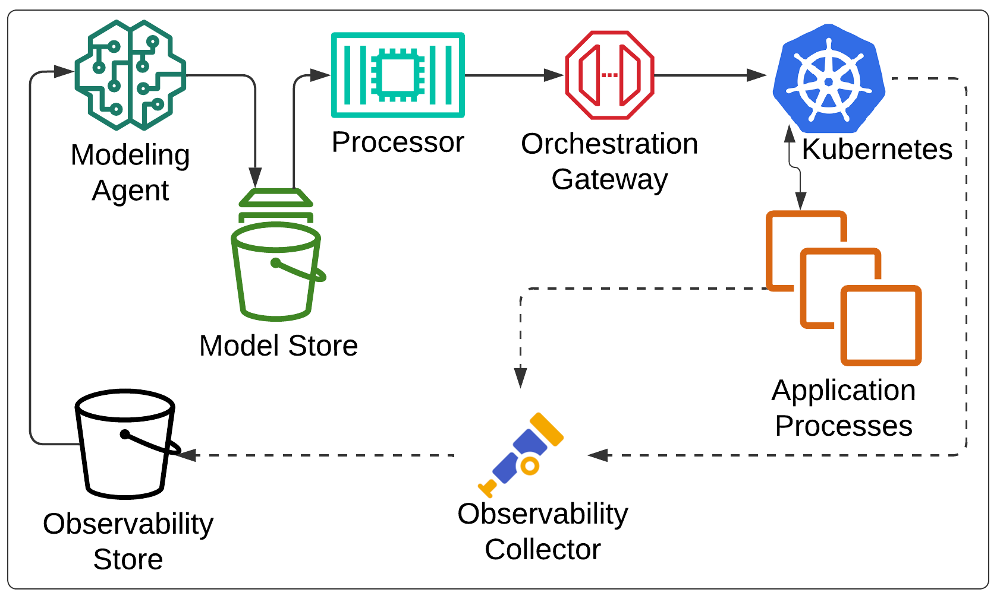

1 Introduction
============

Whether running workloads on remote cloud or on-premises clusters or compute grids, one of the 
most significant factors that can affect operational expense and capital expenditures is proper
resource utilization.  On one side of the spectrum, if you are under utilizing resources, wasted cost
is obvious in the form of unused hardware and network allocation.  On the other side of the spectrum, 
if you are overutilizing resources this can negatively impact response times causing degradation and
failure throughout your application.  At the least this can frustrate your client base,
while in severe cases cause detrimental production outages, leading to possible irreparable damage to your
company or brand.

To combat this, software delivery teams are starting to lean heavily on dynamic workload scaling.  This allows
them to utilize resources efficiently and as needed.  For full scale cloud workloads, this promotes requesting
the optimal amount of resources at any given time, maximizing system throughput when service requests are at their peak
and relinquishing those resources during periods of low traffic.  For on-premises, while the capital expense of buying 
hardware cannot be unwound, there is still benefit as you can properly scale varying workloads throughout different
periods to better share resources across internal development teams and business units.

While technologies exist to varying degrees to support dynamic load scaling, current implementations seem
to have their limits.  Many are focused directly on hardware resources such as CPU and memory.  If the CPU
utilization breaches a certain barrier, then new instances of some computational unit will be spun up.  Some
take a step deeper and will rely on application generated metrics, although there is a direct overhead in
instrumenting the right parts of your application, and making scalers aware of and correlating the correct application
metrics to the right scaling actions.

These metrics are often analyzed and applied in different ways.  Engines can take a manual heuristics based approach,
where operators will often define a set of scaling rules and thresholds based on a working knowledge of the system.
Other systems opt to take an automated approach, usually drawing on some form of machine learning to
make scaling decisions.  The novelty of these systems usually stems in the specific machine learning techniques
and models that are utilized.  Lastly, while not all, a vast portion of auto-scalers are tied directly to a specific orchestration system.  Usually this stems from being tied to a specific cloud vendor, such as AWS or GCP. Vendor-agnostic scalers are likely to be
tied to a single orchestration system, with Kubernetes being the most common case. 

We submit that there is significant novelty in a system that is both extensible and more broadly applicable than the state of the art.
One that is not tied to any specific decision-making mechanism or orchestration technology.  It is also our feeling that
more than simple system level metrics should be used for gaining insight into the system.  In particular, we will make a
case for distributed tracing data alongside system and application metrics.  It is our belief there is a need for
a system which provides abstraction around three different core areas: observability data, decision processing and
orchestration systems.  Such a design would allow researchers to focus on each of these key areas.  This would
allow operators to tailor scaling to both diverse and heterogeneous architectures. 

2 SCALE: The Extensible Autoscaler
==================================

In accordance with the above, we propose **SCALE**, a software system which analyzes various system and application generated
observability data in order to perform dynamic scaling of application work loads in cloud hosted and/or on-premises environments.
We envision a monitor that can make use of open technologies to probe distributed tracing and metric data.  This system would wire up to client APIs of a diverse set of process orchestration software. This can include container orchestrators, serverless function controllers or VM provisioning frameworks amongst others.  Based on processing of the observability data, a processor will make
vertical or horizontal scaling decisions.  These decisions will then be communicated to the orchestration systems via their 
client API to carry out the scaling action.

We are proposing a more customizable solution than the current state of the art.  One that works well with 
multiple open source technologies as well as proprietary cloud APIs, thus making
it more portable across different cloud providers or on-premises orchestration platforms.  Most development teams today instrument their applications in some form for distributed tracing, metrics collection or both.  In addition, orchestration platforms,
web and network proxies and virtualization systems expose a myriad of system level metrics.
These all amount to data points which can be used for real time monitoring, trend research and performance analysis.
However, these same data points could in turn be analyzed, and when combined with a rich set of thresholds and rules provided by development or operational teams, or by automation and machine learning, be the driver behind dynamic resource scaling.

## 2.1 Design

Figure 1 represents the core architecture of SCALE.  The four major components which make up SCALE, are the *modeling agent*, *model store*, *processor* and *orchestration adapter*.  These components work together to form a cohesive, modular workload scaler.  
Aside from the model store, the other components act as vehicles for abstraction, allowing the use of a diverse set of technologies
which best fit the users environment and optimization goals.

### 2.1.1 Modeling Agent

The role of the modeling agent is to ingest varying observability data structures and normalize this data into a common model 
format used by SCALE.  The upstream could be distributed trace stores such as Jaeger or Tempo or metrics stores such as Prometheus
or AWS CloudWatch.  The agent should provide an interface which allows for ingesting from the external source system using whatever
APIs or techniques are provided by that system.  Multiple ingestion patterns should be available with at least a polling and
stream based mechanism.  Data returned from these mechanisms will be the ingested observability data converted to SCALE's common
model.  Separating the ingestion into its own component allows for custom and fine-grained sampling and filtering schemes.

### 2.1.2 Model Store

The model store is responsible for storing and making available SCALE model data. The store will consist of a 
storage component, and ingestion API and an abstraction API.  The storage should provide an in memory implementation out of the
box, however be extensible so that a persistent store such as an indexing engine or key value store can be plugged in.  The ingestion
API is solely for the use of modeling agents to feed in SCALE model data.  The extraction API will be utilized by the processor
to read SCALE model data for analysis.

### 2.1.3 Processor

The processor shall act as the decision-making component of SCALE.  The processor will continuously extract and analyze data from the model repository.  An interface for providing intelligence to the processor will allow implementors to provide custom software and
pipelines for analyzing the data.  This can range from in-line heuristic rule based engines which are configuration driven to full-scale machine learning pipelines.  After analysis the intelligence portion should generate a scaling action object provided as
part of the processor interface.  This object will serve as an abstraction to actions that should be conveyed to the process 
orchestration system to carry out scaling.

### 2.1.4 Orchestration Adapter

The orchestration adapter shall serve as a gateway between the processor and the orchestration system.  Its sole job is to 
convert SCALE action abstractions into primitives that the orchestration system understands.  This allows SCALE to hook to 
different orchestration systems.  This will allow the composition of multiple adapters for heterogeneous environments.

## 2.2 Implementation

SCALE will be implemented as an extendible user-friendly python framework.  For our research we shall design create a 
reference implementation which has at least 1 concrete implementation of the 4 major components.

### 2.2.1 Modeling Agent

The reference implementation for the modeling agent will focus on distributed trace data that is in open telemetry format.  We
go into detail in §3.1 on the merits of distributed trace data over other more readily available metrics data.  This adds to
the novelty of our implementation as most state-of-the-art scalers of note rely solely on system metrics.

### 2.2.2 Model Store

The model store is the component which at its core provides the least abstraction.  The model schema which modeling agents
and processor have to conform to will be concrete.  This includes both the model domain and the ingestion/extraction APIs.  For
the singular component that is interchangeable, the storage backend, the reference implementation shall provide an in-memory
store.  

### 2.2.3 Processor

The reference implementation of the processor shall use a heuristics based approach, where rules around thresholds gleaned
from the model data shall be converted into action objects.  These rules will be taken from manually generated configuration
files.  While an automated approach, especially one using machine learning would be of particular interest to the group,
due to time constraints, the heuristics based approach was chosen.  We further justify this choice in Section §3.2. 

### 2.2.4 Orchestration Adapter

The orchestration adapter reference implementation shall focus on Kubernetes.  Kubernetes is chosen as it is the de facto
standard in container orchestration in industry.  It is available across all major cloud vendors, and available directly
for on-premises workloads or through third party offerings such as Redhat's OpenShift.  Kubernetes can be used for
diverse workloads including long-running services and batch pipelines, and thus makes the most sense for a reference
implementation.

## 2.3 Performance and Overhead

In an auto-scaling system which is reacting in real time to a constant influx of observability data, one must take into 
careful consideration how that system itself is performing.  First and foremost it cannot be a detriment to the system
it is monitoring and making scaling decisions for.  Therefore, in any environment our recommendation is that it be run
on its own resources which do not contend with your core application resources.  

The amount of data that it is ingested from observability sources should also be considered.  Tight control should be put around the sampling and filtering of the ingestion via modeling agents.  The amount of data ingested should coincide with whatever 
network allocation you have provided to the SCALE environment, the amount of storage allocation you have provided to
your model store and the amount of compute resources you have provided to your processor for analysis.  

The final consideration should be in the analysis cycle of your processor.  If you are analyzing too often you can either overwhelm the SCALE environment or worse yet, create further undesired performance issues in your application environment as it is continuously put into a stabilization state.  If you are not analyzing enough, then SCALE will be too slow to react to scaling needs and the
system may degrade at an increasing rate that becomes more difficult to recover from.  Ideally an upper and lower bound
on the analysis cycle should be put in place.  If the lower bound cannot be met, then likely it is up to the operator to
either increase capacity in the SCALE environment, tune observability ingestion volume or review their processor
intelligence model for possible optimization.

Case Studies
============

## 3.1 Distributed Tracing vs. System Level Metrics

It is our intention to describe an application architecture where one could apply several strategies for autoscaling based on performance based observability data. This could be via a heuristics based or automated (i.e. machine learning) approach. The observability data could come from a number of sources including log data, distributed traces, application metrics or process orchestrator metrics. We will then provide the reader with some example scenarios that could induce actions from an auto-scaler. Our examples do not seek to argue the merits of one processing approach over the other.			

The examples instead portend to show a benefit in utilizing distributed tracing data for driving auto- scaling decisions. We approach this from the lens that current state of the art autoscalers rely for the most part upon process orchestrator metrics to drive their scaling. The aforementioned metrics are often confined to physical resources such as CPU or memory utilization, and in some cases IO throughput degradation. We present the reader with a sample architecture in Figure 1 that shall allow us to describe instances where distributed traces would likely provide more robust scaling decisions versus system metrics based counterparts.
				

Let’s start with two separate microservices, Service A and Service B. While the various details of their upstream clients are of little concern to the example, we do focus on one important characteristic for each. The first is that clients to Service A typically send very large payloads in their requests (let us say 5MB on average). The second is that clients to Service B have extremely tight SLOs (let us say 500ms). Both services may do some arbitrary processing on the payloads, which for the example let us assume takes negligible time, and then sends some portion of that processing to the same endpoint of an API gateway. The API gateway then forwards these to a distributed queue to be further processed by a set of serverless workers. The main task of the serverless workers is to provide some validation of each payload and finally persist it into an arbitrary data store. We shall examine two scenarios, both which stem from slow processing by the serverless functions. Auto-scalers using typical orchestration or system level metrics could easily, under certain scenarios, be lead to take misguided scaling actions.			

In the first scenario, let us imagine that persistence under optimal circumstances takes on average 100ms. In this scenario, let us imagine that we have capped ourselves to 100 serverless instances. At some point during the system’s operation, the system sees a spike in traffic and begins to see more than 1000 requests per second total between the two microservices to the API gateway. As we only have 100 instances, and it takes 100ms on average per request for a serverless function to handle a request, we will begin to see a backup in the queue. As this back pressures all the way back to the microservices we can picture multiple things happening. Service A will begin to ramp up in memory usage as it has to buffer large payloads. Service B will begin to miss SLOs, likely resulting in timeouts if they are configured. This could result in a spike in CPU as clients continually attempt retires and these retries begin to stack with legitimately new requests.

The question then is, how would a system level metrics scaler react. It may see that memory is ramping on Service A and begin to vertically scale to more memory for the service. It may see that CPU has spiked on Service B and vertically scale the service. Furthermore, it may see that connections to Service B are stacking due to the timeouts and horizontally scale B. Depending on buffering and back pressure semantics in the API gateway, this scaling could also cascade to gateway as well. If we could examine a complete distributed trace from Service A or Service B all the way through to persistence, it would be clear the bottleneck is with the serverless functions. From there one can further examine that the functions themselves do not have high latency in processing nor in persistence. A scaling system can then make the correct judgment that it is just the cap on our serverless instances and scale those horizontally.
					
One can make a simple counterargument to the above, in that we could simply monitor a metric that represents how many requests are sitting in the distributed queue. If the queue is backed up by some fixed amount, we too can scale. The issue with this approach is that it only provides insight into the latency of the serverless function itself. Is the real issue that some piece of code is running slow due to intense computation or is the function waiting in some blocking IO operation? To further this argument, let us envision a scenario in which database transactions are stacking up, and the database cannot process them all in a timely manner. By utilizing a queue size metric, we simply would have scaled the serverless functions out. This in turn would only serve to further degrade the database. If we were to view a full trace, and we had a trace span directly around the call to the database, we would know the problem is the database itself and can properly scale database resources.
					
The above examples are not meant to completely discredit analysis of system and infrastructure based metrics as a driver for auto-scaling decisions and solutions. Their purpose is show the practicality of leveraging distributed tracing to paint a broader canvas of the health and operation of a distributed system. Well-placed metrics alone could theoretically be pieced together to achieve the same insights as the aforementioned examples. However, this would require very intimate knowledge of your entire dependency graph and for these relationships to be maintained in your monitoring rule set. For smaller systems this may be feasible, but for real-world distributed systems which are composed of hundreds of different services and supporting infrastructure this in untenable. Distributed tracing carries service dependency graphs inherently and so system designers and monitoring software do not have to be fully aware of this graph, and it can easily adapt over time.
		
## 3.2 Human Insight vs. Machine Learning

When surveying the landscape of current auto-scaling systems available, one of the more significant choices that arises is whether to take a heuristics based approach or whether to use a fully automated approach.  Many original scaling systems were based off of Heuristics.  It is of course easier to implement a simple rules based parser than to design a fully automated system.  This allows you to make use of common domain knowledge and directly apply scaling semantics that you think best serves the health of your system.  This of course has some obvious drawbacks.  The most important of these is the constant human intervention.  You will no doubt have to spend well focused man-hours devising your scaling rule set and then whatever time it takes to put pen to paper.  This is also not a one-off cost.  As your system changes over time either due to planned architecting or unforeseen circumstances, you will constantly need to rework your scaling model.  Looking past the manual overhead this approach brings, there is also the fact that humans are not infallible, and any scheme they come up with, while hopefully sound, is quite unlikely to be fully optimal.

Several of the more current papers we researched opt to take some form of automated approach.  As AI and ML are the hottest subjects in computer science, both academically and commercially, this direction is inevitably explored at great length.  Typically, the major differences in these papers is around what machine learning techniques to use.  Some systems, such as FIRM @firm20 and AWARE @aware23, take a reactive approach, often leveraging reinforcement learning.  In this approach, a sort of feedback loop of learning is used, where each scaling action results in a new environmental state and rewards are assigned to each transition to determine if a more optimal state was obtained.  As time progresses, the system can take actions based on prior rewards that are more likely to transition to the most optimal state.

Other systems take a more proactive approach. For instance, Madu @powpred22 uses regression techniques backed by TensorFlow to generate predictive models that can sense load before or as it is ramping up to attempt to prevent degradation before it happens.  While both of these approaches address the prior issue of added human overhead through automation, they still cannot truly guarantee optimal scaled state at all times.  What's more is that ML based solutions often introduce a great deal more complexity due the extra components they often require, as well as the overhead of initial model training as well as retraining to cope with systematic change.

This then brings us to the choice, should we use the insightful approach or the machine learning approach when both analyzing observability data and making scaling decisions within SCALE.  The conclusion that we came to is that we should not lock into either.  Instead, we intend to make this portion of SCALE interchangeable, with the hope that it is also eventually composable.  Indeed, many highly effective state of the art auto-scalers take a heuristics based approach, and most new research seeks to justify moving to an ML based framework.  Yet, there is no concrete evidence that one is an order of magnitude better than the other.  In fact, one of the most compelling works we read @needed23, takes this head on.  In their paper, they present a strong argument that the most effective system makes use of both, and ML only approaches typically only provide a shifted version of the original training data.  Even certain ML based solutions make at least in part some use of human insight, such as AWARE @aware23 which utilizes a heuristics approach in its offline training mode.

## 3.3 Importance of finding root cause

Fourati et al. @towards23, in an attempt to provide review of autoscaling services, mentions that 	
autoscaler can typically be classified as solutions using basic analysis where scaling happens without analyzing and identifying the root cause of resource violation, and another solution using advanced analysis where it tries to identify the root cause of resource violation. It 	
concludes that many autoscaler do not do analysis to identify the root cause when it detects the threshold exceeding. It further stresses that the incorrect resource saturation identification leads to unnecessary resource allocation which may inadvertently affect the system performance itself. 

## 3.4 Cost of implementation

Straesser et al. @whysolve22 argue that most state-of-art autoscaler find it difficult to be implemented in production because they are often too complex. Moreover, they often rely on traditional platform metrics, for example CPU, based scaling. There are applications where the performance profile is not CPU or memory dominated. In those cases, there is an advantage in scaling based on the combination of both platform and application metrics. Additionally, there is a notable lack of generic, general-purpose auto scalers to address these needs. 
 
As mentioned by Eder et al. @comdist23, there are different distributed tracing out there. And one important factor that needs to be considered is the resulting cost of its deployment, especially when it comes to deploying it in a pay-per-use billing model. Also, for practical purposes, it is essential that distributed tracing does not significantly degrade application performance. Eder et al. compares serverless application executing with and without tracing. It further observed the performance impact - measured in terms of runtime, memory usage, and initialization duration varied across the tools analyzed (Zipkin, Otel, and SkyWalking). It concludes that with appropriate tool selection, the advantages of distributed tracing can be maximized while minimizing performance drawbacks. 

## 3.5 Latency Scaling

Yu et al. @microscaler19 proposed Microscaler that aimed to identify the services that need scaling to meet the SLA requirement. And it does it by collecting service metrics (QoS, i.e. latency) in service mesh enabled architecture by injecting proxy sidecars alongside each microservice application. Although this method is novel, it makes scaling decisions solely based on latency and uses sidecars to collect the metrics. 
 
This is not to say that all auto-scaling decisions are based on simple approaches like monitoring CPU, memory, or latency. There has been study, such as the study done by Thanh-Tung et al. @hpa20, in which the authors use Prometheus Custom Metrics (PCM) to collect HTTP request metrics. The collected metric is then compared against Kubernetes Resource Metrics (KRM) and its impact on Horizontal Pod Autoscaler (HPA) in Kubernetes is analyzed. The authors note that using metrics obtained from PCM increases the effectiveness of HPA but falls short in mentioning how PCM can be used to identify resources which might be a potential candidate for auto-scaling. 

4 System Evaluation
=================

## 4.1 Overview

To evaluate our system, we will create a comprehensive testing environment that simulates 
real-world traffic patterns, bottlenecks, and resource constraints. This setup will allow for
controlled comparisons between baseline autoscaling (CPU/memory-based) and our
observability-driven system. We will evaluate the autoscaling systems using open-source
benchmarking suites such as DeathStarBench, Train Ticket, and Online Boutique, along with an
in-house architecture resembling a personal finance application. To simulate production-like
environments, we will use additional open-source tools, including Locust and Chaos Mesh, to
generate realistic traffic surges and failure conditions across microservices. Our goal is to
measure the speed and accuracy of autoscaling decisions made by the observability-driven
system compared to the baseline.

## 4.2 Hypothesis

We hypothesize that observability-driven autoscaling will outperform traditional autoscaling
methods in terms of:

1. **Efficiency:** The system will scale more precisely, reducing the over-allocation of resources (e.g., CPU/memory) while meeting performance goals.
2. **SLO Adherence:** The system will better maintain Service Level Objectives (SLOs) such as latency, throughput, and error rates by responding faster to bottlenecks.
3. **System Resilience:** The observability-driven system will demonstrate quicker recovery times from anomalies and failures, as it will identify the root causes faster through trace analysis.

## 4.3 Measurements

The following key metrics will be collected to evaluate system performance:

1. **CPU and Memory Utilization:** While the observability system doesn’t rely solely on these, we will measure them to compare resource consumption between the two configurations.
2. **Request Latency:** We will measure end-to-end latency from client requests to the backend service. Reduced latency in the observability-driven system will indicate quicker response times to scaling triggers.
3. **Throughput:** The number of requests successfully processed per second. We will track whether the system maintains higher throughput without overloading.
4. **Error Rates:** We will monitor error rates, including timeouts, service crashes, or failed requests, particularly during periods of heavy load or injected faults.
5. **SLO Adherence:** The percentage of requests that meet predefined SLOs for latency or throughput. Observability-driven scaling is expected to keep the system within these limits more consistently.
6. **Scaling Response Time:** We will measure the time it takes for the autoscaler to detect a bottleneck and provision new resources. The observability system should react more quickly and precisely, reducing the time spent in an under-provisioned state.
7. **Queue Lengths and Backlogs:** We will track queue depth, particularly at choke points such as message queues and API gateways. A key metric will be how quickly the system scales serverless workers or microservices to process the queue without resource over-provisioning.

## 4.4 Successful Outcomes

A successful outcome for the experiment will be defined by the observability-driven system demonstrating clear improvements across the following criteria:

1. **Improved Resource Efficiency:** The system should scale up and down more precisely, avoiding unnecessary resource allocation while meeting workload demands. We expect to see reduced CPU/memory usage compared to the baseline.
2. **Better Adherence to SLOs:** The observability-driven system should show fewer latency breaches and higher throughput under load, demonstrating superior adherence to SLOs.
3. **Faster Bottleneck Detection and Resolution:** By utilizing distributed tracing data, the system should detect and resolve bottlenecks faster than the baseline, leading to improved system resilience and reduced downtime.
4. **Scalable and Modular Architecture:** The pluggable backend should allow seamless transitions between different telemetry platforms (e.g., Tempo to Jaeger) without affecting system performance. The scalability of the system should be demonstrated across multiple architectures, including our custom setup.

By achieving these outcomes, we will validate the hypothesis that observability-driven autoscaling is more effective than traditional autoscaling mechanisms.

\clearpage

References
==========
:::refs
:::

