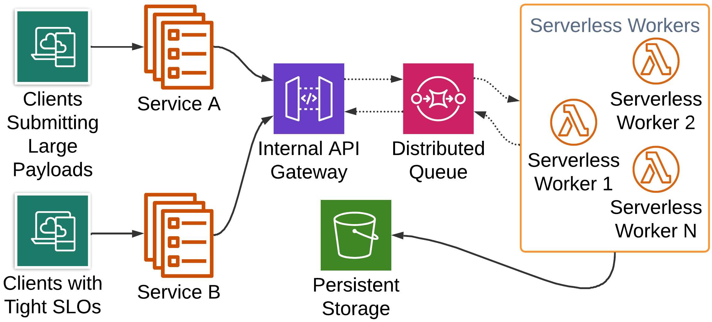
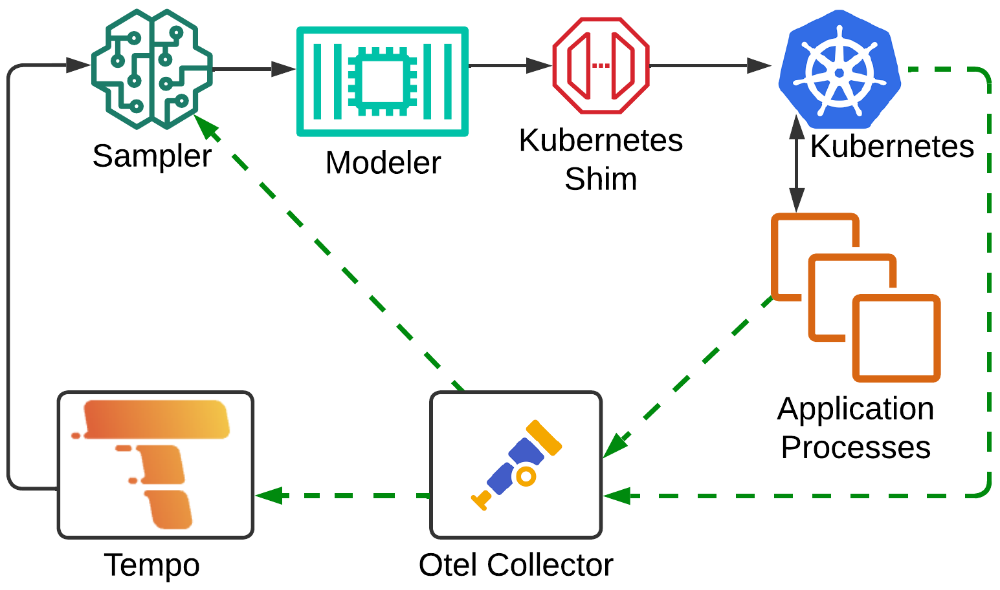

1 Introduction
==============

Whether running workloads on remote cloud or on-premises clusters or compute grids, one of the 
most significant factors that can affect operational expense and capital expenditures is proper
resource utilization.  On one side of the spectrum, if you are under utilizing resources, wasted cost
is obvious in the form of unused hardware and network allocation.  On the other side of the spectrum, 
if you are overutilizing resources this can negatively impact response times causing degradation and
failure throughout your application.  At the least this can frustrate your client base,
while in severe cases cause detrimental production outages, leading to possible irreparable damage to your
company or brand.

To combat this, software delivery teams are starting to lean heavily on dynamic workload scaling.  This allows
them to utilize resources efficiently and as needed.  For full scale cloud workloads, this promotes requesting
the optimal amount of resources at any given time, maximizing system throughput when service requests are at their peak
and relinquishing those resources during periods of low traffic.  For on-premises, while the capital expense of buying 
hardware cannot be unwound, there is still benefit as you can properly scale varying workloads throughout different
periods to better share resources across internal development teams and business units.

While technologies exist to varying degrees to support dynamic load scaling, current implementations seem
to have their limits.  Many are focused directly on hardware resources such as CPU and memory.  If the CPU
utilization breaches a certain barrier, then new instances of some computational unit will be spun up.  Some
take a step deeper and will rely on application generated metrics, although there is a direct overhead in
instrumenting the right parts of your application, and making scalers aware of and correlating the correct application
metrics to the right scaling actions.

These metrics are often analyzed and applied in different ways.  Engines can take a manual heuristics based approach,
where operators will often define a set of scaling rules and thresholds based on a working knowledge of the system.
Other systems opt to take an automated approach, usually drawing on some form of machine learning to
make scaling decisions.  The novelty of these systems usually stems in the specific machine learning techniques
and models that are utilized.  Lastly, while not all, a vast portion of autoscalers are tied directly to a specific orchestration system.  Usually this stems from being tied to a specific cloud vendor, such as AWS or GCP. Vendor-agnostic scalers are likely to be
tied to a single orchestration system, with Kubernetes being the most common case. 

We submit that there is significant novelty in a system that is both extensible and more broadly applicable than the state of the art.
One that is not tied to any specific decision-making mechanism or orchestration technology.  It is also our feeling that
more than simple system level metrics should be used for gaining insight into the system.  It is our belief there is a need for
a system which provides abstraction around three different core areas: observability data, decision processing and
orchestration systems.  Such a design would allow researchers to focus on each of these key areas.  This would
allow operators to tailor scaling to both diverse and heterogeneous architectures. In particular, we will make a
case for SCALE, a system which emphasizes the use of distributed tracing to gain deeper insights into the call
graphs of distributed systems. Using these traces we will generate scaling signals based on the analysis of tail latencies of individual calls within those graphs.

2 Background & Characterization
===============================

## 2.1 Related Works

In our research, we drew particular motivation from gaps in the current state of the art of autoscaling systems pointed out
by our fellow researchers.  Much of this fell in line with our vision, and helped reinforce the direction we took in our
own implementation.

### 2.1.1 Importance of Finding Root Cause

Fourati et al. @towards23, in an attempt to provide review of autoscaling services, mentions that
autoscalers can typically be classified as solutions which use basic analysis where scaling happens without identifying the root cause of resource violation. The paper poses that the need for a solution which uses advanced analysis that attempts to identify the root cause of resource violation when thresholds are exceeded is necessary.  It further stresses that incorrect resource saturation identification leads to unnecessary resource allocation which may inadvertently affect the system performance itself. 

### 2.1.2 Cost of Implementation

Straesser et al. @whysolve22 argue that most state-of-art autoscalers are difficult to implement in production because they are often too complex. Moreover, they often rely on traditional platform metrics, for example CPU based scaling. There are applications where the performance profile is not CPU or memory dominated. In those cases, there is an advantage in scaling based on the combination of both platform and application metrics. Additionally, there is a notable lack of generic, general-purpose auto scalers to address these needs. 
 
As mentioned by Eder et al. @comdist23, there are many different distributed tracing implementations current. One important factor that needs to be considered is the resulting cost of its deployment, especially when it comes to deploying it in a pay-per-use billing model. Also, for practical purposes, it is essential that distributed tracing does not significantly degrade application performance. Eder et al. compares serverless applications executing with and without tracing. It further observed the performance impact - measured in terms of runtime, memory usage, and initialization duration varied across the tools analyzed (Zipkin, Otel, and SkyWalking). It concludes that with appropriate tool selection, the advantages of distributed tracing can be maximized while minimizing performance drawbacks. 

### 2.1.3 Latency Scaling

Yu et al. @microscaler19 proposed Microscaler that aimed to identify the services that need scaling to meet SLA requirements.  it achieves this by collecting service metrics (QoS, i.e. latency) in service mesh enabled architecture by injecting proxy sidecars alongside each microservice application. Although this method is novel, it makes scaling decisions solely based on latency and uses sidecars to collect the metrics. 
 
This is not to say that all autoscaling decisions are based on simple approaches like monitoring CPU, memory, or latency. There has been study, such as the study done by Thanh-Tung et al. @hpa20, in which the authors use Prometheus Custom Metrics (PCM) to collect HTTP request metrics. The collected metrics are then compared against Kubernetes Resource Metrics (KRM) and its impact on Horizontal Pod Autoscaler (HPA) in Kubernetes is analyzed. The authors note that using metrics obtained from PCM increases the effectiveness of HPA but falls short in mentioning how PCM can be used to identify resources which might be a potential candidate for autoscaling. 

## 2.2 Distributed Tracing vs. System Level Metrics

It is our intention to describe an application architecture where one could apply several strategies for autoscaling based on performance based observability data. This could be via a heuristics based or automated (i.e. machine learning) approach. The observability data could come from a number of sources including log data, distributed traces, application metrics or process orchestrator metrics. We will then provide the reader with some example scenarios that could induce actions from an autoscaler. Our examples do not seek to argue the merits of one processing approach over the other.			

The examples instead portend to show a benefit in utilizing distributed tracing data for driving auto- scaling decisions. We approach this from the lens that current state of the art autoscalers rely for the most part upon process orchestrator metrics to drive their scaling. The aforementioned metrics are often confined to physical resources such as CPU or memory utilization, and in some cases IO throughput degradation. We present the reader with a sample architecture in Figure 1 that shall allow us to describe instances where distributed traces would likely provide more robust scaling decisions versus system metrics based counterparts.
				


Let’s start with two separate microservices, Service A and Service B. While the various details of their upstream clients are of little concern to the example, we do focus on one important characteristic for each. The first is that clients to Service A typically send very large payloads in their requests (let us say 5MB on average). The second is that clients to Service B have extremely tight SLOs (let us say 500ms). Both services may do some arbitrary processing on the payloads, which for the example let us assume takes negligible time, and then sends some portion of that processing to the same endpoint of an API gateway. The API gateway then forwards these to a distributed queue to be further processed by a set of serverless workers. The main task of the serverless workers is to provide some validation of each payload and finally persist it into an arbitrary data store. We shall examine two scenarios, both which stem from slow processing by the serverless functions. autoscalers using typical orchestration or system level metrics could easily, under certain scenarios, be lead to take misguided scaling actions.			

In the first scenario, let us imagine that persistence under optimal circumstances takes on average 100ms. In this scenario, let us imagine that we have capped ourselves to 100 serverless instances. At some point during the system’s operation, the system experiences a spike in traffic and begins to see more than 1000 requests per second total between the two microservices to the API gateway. As we only have 100 instances, and it takes 100ms on average per request for a serverless function to handle a request, we will begin to see a backup in the queue. As this back pressures all the way back to the microservices we can picture multiple occurrences. Service A will begin to ramp up in memory usage as it has to buffer large payloads. Service B will begin to miss SLOs, likely resulting in timeouts if they are configured. This could result in a spike in CPU as clients continually attempt retires and these retries begin to stack with legitimately new requests.

The question then is, how would a system level metrics scaler react. It may see that memory is ramping on Service A and begin to vertically scale to more memory for the service. It may see that CPU has spiked on Service B and vertically scale the service. Furthermore, it may see that connections to Service B are stacking due to the timeouts and horizontally scale B. Depending on buffering and back pressure semantics in the API gateway, this scaling could also cascade to the gateway as well. If we could examine a complete distributed trace from Service A or Service B all the way through to persistence, it would be clear the bottleneck is with the serverless functions. From there one can further observe that the functions themselves do not have high latency in processing nor in persistence. A scaling system can then make the correct judgment that it is just the cap on our serverless instances and scale those horizontally.
					
One can make a simple counterargument to the above, in that we could simply monitor a metric that represents how many requests are sitting in the distributed queue. If the queue is backed up by some fixed amount, we too can scale. The issue with this approach is that it only provides insight into the latency of the serverless function itself. Is the real issue that some piece of code is running slow due to intense computation or is the function waiting in some blocking IO operation? To further this argument, let us envision a scenario in which database transactions are stacking up, and the database cannot process them all in a timely manner. By utilizing a queue size metric, we simply would have scaled the serverless functions out. This in turn would only serve to further degrade the database. If we were to view a full trace, and we had a trace span directly around the call to the database, we would know the problem is the database itself and can properly scale database resources.
					
The above examples are not meant to completely discredit analysis of system and infrastructure based metrics as a driver for autoscaling decisions and solutions. Their purpose is show the practicality of leveraging distributed tracing to paint a broader canvas of the health and operation of a distributed system. Well-placed metrics alone could theoretically be pieced together to achieve the same insights as the aforementioned examples. However, this would require very intimate knowledge of your entire dependency graph and for these relationships to be maintained in your monitoring rule set. For smaller systems this may be feasible, but for real-world distributed systems which are composed of hundreds of different services and supporting infrastructure this is untenable. Distributed tracing carries service dependency graphs inherently and so system designers and monitoring software do not have to be fully aware of this graph, and it can easily adapt over time.
		
## 2.3 Human Insight vs. Machine Learning

When surveying the landscape of current autoscaling systems available, one of the more significant choices that arises is whether to take a heuristics based approach or whether to use a fully automated approach.  Many original scaling systems were based off of Heuristics.  It is of course easier to implement a simple rules based parser than to design a fully automated system.  This allows you to make use of common domain knowledge and directly apply scaling semantics that you think best serves the health of your system.  This of course has some obvious drawbacks.  The most important of these is the constant human intervention.  You will no doubt have to spend well focused man-hours devising your scaling rule set and then whatever time it takes to put pen to paper.  This is also not a one-off cost.  As your system changes over time either due to planned architecting or unforeseen circumstances, you will constantly need to rework your scaling model.  Looking past the manual overhead this approach brings, there is also the fact that humans are not infallible, and any scheme they come up with, while hopefully sound, is quite unlikely to be fully optimal.

Several of the more current papers we researched opt to take some form of automated approach.  As AI and ML are the hottest subjects in computer science, both academically and commercially, this direction is inevitably explored at great length.  Typically, the major differences in these papers is around what machine learning techniques to use.  Some systems, such as FIRM @firm20 and AWARE @aware23, take a reactive approach, often leveraging reinforcement learning.  In this approach, a sort of feedback loop of learning is used, where each scaling action results in a new environmental state and rewards are assigned to each transition to determine if a more optimal state was obtained.  As time progresses, the system can take actions based on prior rewards that are more likely to transition to the most optimal state.

Other systems take a more proactive approach. For instance, Madu @powpred22 uses regression techniques backed by TensorFlow to generate predictive models that can sense load before or as it is ramping up to attempt to prevent degradation before it happens.  While both of these approaches address the prior issue of added human overhead through automation, they still cannot truly guarantee optimal scaled state at all times.  What's more is that ML based solutions often introduce a great deal more complexity due the extra components they often require, as well as the overhead of initial model training as well as retraining to cope with systematic change.

This then brings us to the choice, should we use the insightful approach or the machine learning approach when both analyzing observability data and making scaling decisions within SCALE.  The conclusion that we came to is that we should not lock into either.  Instead, we intend to make this portion of SCALE interchangeable, with the hope that it is also eventually composable.  Indeed, many highly effective state of the art autoscalers take a heuristics based approach, and most new research seeks to justify moving to an ML based framework.  Yet, there is no concrete evidence that one is an order of magnitude better than the other.  In fact, one of the most compelling works we read @needed23, takes this head on.  In their paper, they present a strong argument that the most effective system makes use of both, and ML only approaches typically only provide a shifted version of the original training data.  Even certain ML based solutions make at least in part some use of human insight, such as AWARE @aware23 which utilizes a heuristics approach in its offline training mode.


3 SCALE Design
==============

## 3.1 Overview

In accordance with the statements observations outlined in §1 and §2, we introduce SCALE, a software system which analyzes various system and application generated
observability data in order to perform dynamic scaling of application work loads in cloud hosted and/or on-premises environments.
We envision a monitor that can make use of open technologies to probe distributed tracing and metric data.  This system would wire up to client APIs of a diverse set of process orchestration software. This can include container orchestrators, serverless function controllers or VM provisioning frameworks amongst others.  Based on processing of the observability data, a processor will make
vertical or horizontal scaling decisions.  These decisions will then be communicated to the orchestration systems via their 
client API to carry out the scaling action.

We are proposing a more customizable solution than the current state of the art.  One that works well with 
multiple open source technologies as well as proprietary cloud APIs, thus making
it more portable across different cloud providers or on-premises orchestration platforms.  Most development teams today instrument their applications in some form for distributed tracing, metrics collection or both.  In addition, orchestration platforms,
web and network proxies and virtualization systems expose a myriad of system level metrics.
These all amount to data points which can be used for real time monitoring, trend research and performance analysis.
However, these same data points could in turn be analyzed, and when combined with a rich set of thresholds and rules provided by development or operational teams, or by automation and machine learning, be the driver behind dynamic resource scaling.

While we aim for extensibility, the true novelty of our research hinges on the viability of making scaling decisions 
based on distributed tracing data.  Hence, our implementation will directly focus on the consumption, sampling and analysis of traces.
The analysis centers around a heuristics based trace modeler which will check trace spans for latency breaches above configured
thresholds.  Based on actions attached to those thresholds, when breached, the modeler will initiate scaling directives via a shim
that sits atop of the Kubernetes API.

## 3.2 Architecture



Figure \ref{scale_arch} represents the core architecture of SCALE.  The three major components which make up SCALE itself are the *sampler*, *modeler*, *orchestration shim*.  These components work together to form a cohesive, modular workload scaler.  

The components are built as implementations upon abstractions allowing for future adoption of other sampling algorithms, decision-making models or orchestration technologies.  SCALE is also dependent upon a distributed trace storage mechanism
and a distributed trace delivery mechanism. For these we use Grafana Tempo and OTEL Collector respectively.  Much
of the communication between components happens over a protocol standard for distributed traces known as OTLP.

### 3.2.1 OpenTelemetry & OTLP

The fundamental component of the SCALE workflow is a distributed trace.  The most common state of the art way to model distributed traces is via
[OpenTelemetry](https://opentelemetry.io/).  _OpenTelemetry is a collection of APIs, SDKs, and tools. It is used to instrument, generate, collect, and export telemetry data (metrics, logs, and traces) to help you analyze your software’s performance and behavior @otel24\._ OpenTelemetry provides a uniform data schema for modeling distributed traces as well as serialization in JSON or protocol buffers.  Traces are modeled conceptually as a hierarchy within a DAG.  Each measured operation of a distribute trace is referred to as a span.  A trace is provided with a unique trace id.  All spans share the trace id, and in addition contain their own span id.  Each span also holds the span id of it's parent (unless it is the root span), the start and end timestamp of the span, as well as other various metadata. 

In addition to the schema model, a protocol for sending and receiving traces is provided.  This protocol is known colloquially as OTLP and is offered over either HTTP REST or gRPC transport.  SCALE as well as it's supporting components make direct use of both the protocol buffer schema as well as the OTLP gRPC transport.  This allows us to model and pass telemetry data throughout the system in a uniform manner, as well as not tying SCALE directly to any specific supporting component.

### 3.2.2 Collector & Tempo

In addition to OTLP and its accompanying schema, OpenTelemetry provides [Collector](https://opentelemetry.io/docs/collector/), a _vendor-agnostic way to receive, process and export telemetry data @otel24\._   In SCALE's case it allows us to build a pipeline for distributed traces.  The source of these traces can be either applications or infrastructure.  In the case of SCALE it would be microservices or batch jobs running in Kubernetes.  In addition, Kubernetes components directly support emitting traces giving you insight into  performance of the kubernetes API and kubelets.  Collector can be extended to receive traces from sources other than those supporting OTLP, and in fact it currently has support for dozens of other ingestion mechanisms.  Thus, while SCALE itself is implemented over OTLP, upstream distributed traces can be generated via a number of different methods.

As traces are sent into Collector, they are then in turn sent downstream to multiple components in the SCALE environment.  One of those components is [Grafana Tempo](https://grafana.com/oss/tempo/), 
_an open source, easy-to-use, and high-scale distributed tracing backend @tempo24\._  Tempo facilitates storing and querying of distributed tracing data.  In the case of SCALE, the storage backend configured for Tempo is local disk, however in large scale production environments this can be made to point to various object stores such as S3 or GCS.  The flow of data from applications and Kubernetes, to Collector, and ultimately to Tempo can be seen in figure \ref{scale_arch}, represented by the green dashed lines.  There is one additional line in this workflow, to the sampler, which we describe next.

### 3.2.3 Sampler

The sampler is the first direct SCALE component within the architecture's overall pipeline.  The job of the sampler is to sample traces for anomalies before they are sent downstream for scaling analysis.  This allows SCALE to predetermine interesting traces in a fast manner, so that extra resources are not wasted on a deep analysis of the call graph.  While SCALE currently relies on a simple heuristics based analysis of traces, there is still a non-insignificant overhead involved
in analyzing large call graphs that should be avoided if possible.  This would be further exacerbated if the modeler (described in §3.2.4) were swapped for an implementation that relied on a more compute intensive approach. 

The sampler uses a model described by _TRACEMESH @tracemesh24\,_ which details a framework for fast and efficient sampling of streaming distributed traces.  The model works by first encoding the traces into vectors.  This is done by taking a set of traces in a micro-batch, and enumerating each linear call
path within the entire set of traces in that batch, and mapping those paths to an index into a vector.  A vector is then populated for each trace, by taking the
latency to log base of 10 of the tail span of each of it's call paths, and populating the value at the index corresponding to that respective path.  If a given trace does not contain the path for a given index then a zero is populated.

The next step in this process sketches the vectors onto new vectors of a fixed length.  The reason for this as that each micro-batch may likely produce vectors
of varying length on each run.  As these vectors eventually are fed to a clustering algorithm, each element is treated as a feature.  Given this, we want to feed
in a uniform set of features to the algorithm, so that we do not have to extend or truncate already fed vectors and likely retrain the model.  This sketching is
performed using a locality sensitive hashing algorithm, implemented from the works described by _STREAMHASH @streamhash16\._  This sketches the original latency value based vectors into fixed length bit vectors.  In additions to the reasoning above, this also provides for very memory-efficient data structures.

The final step in the model is to sample the traces via evolving clustering.  For this, _DENSTREAM @denstream06\,_ a density based clustering algorithm.  In the algorithm, multiple micro-clusters are introduced.  A core micro cluster is introduced for the entries which do not pose as anomalistic.  Then several smaller 
outlier micro-clusters exist to identify anomalies.  As the model is evolving, the clusters are pruned to guarantee the weighting of each, and hence the model adapts to new traces which may no longer pose as anomalies.  This is often due in part to yet to be seen call graphs, possibly from new services or the like, being introduced to the model.

To initially train the clustering model, a pre-configured set of traces are queried from Tempo via an HTTP REST service which provides traces in OpenTelemetry protocol buffer format.  The traces are stored in a pandas data frame as they are collected, then passed through a conversion algorithm that prepares them for the clustering algorithm.  After the model has been successfully trained, the sampler starts a gRPC listener which expose two RPCs.  The first is an implementation of the OTLP gRPC interface for receiving traces.  As shown in figure \ref{scale_arch}, this allows Collector to stream new traces into the sampler as they are received from upstream applications and infrastructure.  The second RPC provides an endpoint that streams identifiers of sampled traces to prospective clients.

### 3.2.4 Modeler

The modeler is the central component of the SCALE architecture.  It is the task of the modeler to analyze traces and make the ultimate decision on whether to perform any scaling operations.  The modeler is configured with a set of rules defined via a YAML configuration file.  These rules associate latency thresholds with scaling actions.  An example of this is of the form _scale service A if operation B reaches a latency of X, N times within a given window._  The rules then drive the heuristics based analysis of the distributed traces received from the sampler.  

The modeler will initiate a streaming gRPC connection to receive the sampled trace identifiers.  As trace identifiers are received by the modeler, the modeler will then query Tempo for the complete trace call graph.  The graph's spans are then flattened into a pandas dataframe.  The rule set defined in the configuration file is then applied as precompiled predicates against the dataframe.  Any rules whose criteria is a match has their actions folded into a conflated action set.  The purpose of conflation is to deduplicate redundant scaling actions.  When the analysis is complete the modeler will then call the Kubernetes shim to perform the scaling action.  

### 3.2.5 Kubernetes Shim

The Kubernetes shim acts as a layer between the Modeler and Kubernetes itself.  Its purpose is to abstract away the specific details of the Kubernetes API, to provide a more generic scaling interface to the Modeler.  This abstraction model allows for the ability to swap out service orchestration backends, or more realistically to compose multiple backends.  This is manifested in the form of an OrchestrationClient interface which provides a stub for scaling a resource, and another for getting the current scale of a resource.  The shim is meant to be intentionally light weight, and implementations are called directly within the modeler process.  

## 3.3 Performance and Overhead

In an autoscaling system which is reacting in real time to a constant influx of observability data, one must take into 
careful consideration how that system itself is performing.  First and foremost it cannot be a detriment to the system
it is monitoring and making scaling decisions for.  Therefore, in any environment our recommendation is that it be run
on its own resources which do not contend with your core application resources.  

The amount of data that is ingested from observability sources should also be considered.  Tight control should be put around the sampling and filtering of the ingestion.  The amount of data ingested should coincide with whatever network allocation is provided to the SCALE environment, the amount of memory provided to
the sampler and the amount of compute resources you have provided to the modeler for analysis.  This can be configured either via tuning parameters of the
sampler, or pre-sampling and filtering techniques configured within the OpenTelemetry Collector.

The final consideration should be in the analysis cycle of the modeler.  If the modeler is analyzing too often it can overwhelm the SCALE environment.
Worse yet, it can create further undesired performance issues in the application environment, as it is continuously put into a stabilization state due to over-scaling.  If the modeler is not analyzing enough, then SCALE will be too slow to react to scaling needs and the
system may degrade at an increasing rate that becomes more difficult to recover from.  Ideally an upper and lower bound
on the analysis cycle should be put in place.  If the lower bound cannot be met, then likely it is up to the operator to
either increase capacity in the SCALE environment, tune observability ingestion volume or review their modeler rule set model for possible optimization.


4 Evaluation
============

## 4.1 Overview

To evaluate our system, we will create a comprehensive testing environment that simulates 
real-world traffic patterns, bottlenecks, and resource constraints. This setup will allow for
controlled comparisons between baseline autoscaling (CPU/memory-based) and SCALE. We will evaluate the autoscaling systems using open-source
benchmarking suites, along with an in-house architecture resembling a personal finance application. To simulate production-like
environments, we will use additional open-source simulation tools and chaos testing tools to
generate realistic traffic surges and failure conditions across microservices. Our goal is to
measure the speed and accuracy of autoscaling decisions made by the observability-driven
system compared to the baseline.

## 4.1.1 Key Metrics

### 4.1.1.1 Hypothesis

We hypothesize that SCALE's autoscaling will outperform traditional autoscaling
methods in terms of:

1. **Efficiency:** SCALE will scale more precisely, reducing the over-allocation of resources (e.g., CPU/memory) while meeting performance goals.
2. **SLO Adherence:** SCALE will better maintain Service Level Objectives (SLOs) such as latency, throughput, and error rates by responding faster to bottlenecks.
3. **System Resilience:** SCALE will demonstrate quicker recovery times from anomalies and failures, as it will identify the root causes faster through trace analysis.

### 4.1.1.2 Measurements

1. **CPU and Memory Utilization:** While SCALE doesn’t rely solely on these, we will measure them to compare resource consumption between the two configurations.
2. **Request Latency:** We will measure end-to-end latency from client requests to the backend service. Reduced latency in SCALE will indicate quicker response times to scaling triggers.
3. **Throughput:** The number of requests successfully processed per second. We will track whether the system maintains higher throughput without overloading.
4. **Error Rates:** We will monitor error rates, including timeouts, service crashes, or failed requests, particularly during periods of heavy load or injected faults.
5. **SLO Adherence:** The percentage of requests that meet predefined SLOs for latency or throughput. Distributed trace driven scaling is expected to keep the system within these limits more consistently.
6. **Scaling Response Time:** We will measure the time it takes for the autoscaler to detect a bottleneck and provision new resources. SCALE should react more quickly and precisely, reducing the time spent in an under-provisioned state.

### 4.1.1.3 Successful Outcomes

1. **Improved Resource Efficiency:** SCALE should scale up and down more precisely, avoiding unnecessary resource allocation while meeting workload demands. We expect to see reduced CPU/memory usage compared to the baseline.
2. **Better Adherence to SLOs:** SCALE should show fewer latency breaches and higher throughput under load, demonstrating superior adherence to SLOs.
3. **Faster Bottleneck Detection and Resolution:** By utilizing distributed tracing data, SCALE should detect and resolve bottlenecks faster than the baseline, leading to improved system resilience and reduced downtime.

## Environment Setup

For our testing we have setup a Kubernetes environment using [Minikube](https://minikube.sigs.k8s.io/), which allows us to spin up full fledged Kubernetes clusters on a single physical node.  The server environment is a single 24 core 13th Gen Intel(R) Core(TM) i7-13700F, with 64GiB of dual channel DDR4 main memory.  CPU and memory resources alloted to Minikube are configurable, with defaults of 2 virtual cores and 2GiB of memory.  We tune these levels, typically increasing them depending on the particular experiment.  For test clusters, we are currently utilizing the open-source [Online Boutique](https://github.com/Mark-McCracken/online-boutique) benchmark as well as a custom built suite which simulates a financial planning application.  As experimentation progresses we will likely explore further open-source benchmarks.  For visualizing and examining trace data at rest in Tempo, we are deploying and using [Grafana](https://grafana.com/).

## 4.2 Sampler Experimentation

Prior to testing the end-to-end performance of SCALE, we first looked to test the performance of the sampler in isolation.  The key metric for testing the sampler is to achieve a set sampling budget, which can be given as a parameter to DENSTREAM.  This budget acts as a percent of the seen traces which ultimately pass through the clustering model as an anomaly.  We initially deployed the sampler, along with Tempo and Collector to an isolated Kubernetes namespace.  Collector was configure to listen for traces via OTLP, and to forward traces to both Tempo and the sampler.  To seed Tempo with initial trace data we used the [otelgen](https://github.com/krzko/otelgen) utility.  This utility allows you to choose from a set of predefined scenarios to generate various observability data.  Choosing from it's microservice and database scenarios, we simulated several hundred distributed traces and sent them directly to Collector.

As Collector receives the traces they are initially sent to Tempo.  The sampler periodically polls Tempo, until it reaches a configured limit of traces suitable for training the cluster model.  Once the training is complete, the sampler will then open it's own OTLP receiver and begin to receive streaming traces from Collector.  For our initial tests we aimed to hit a 1% sampling budget.  During these tests, we have thus far tested with changing the training set size, using 100, 500, 1000 and 2000 traces.  On the low end of training we saw poor sampling rates, often times as bad as 40% or more per sampling round.  On the higher end things improved to around 5%.  

For milestone 4, we intend to continue testing and tuning the sampler in isolation as well as within the full system, in order to increase efficiency to better align with our desired sampling budget.  While initial tests merely tuned the training set size, we have the ability to adjust several other parameters which we plan to test.  These include our micro-batch sampling rate as well as a number of model parameters for the clustering algorithm.  Another factor we have considered in our initial testing is the lack of diversity with traces generated by otelgen.  As the traces are inherently quite similar, this probably isolates and tightens the core cluster in the algorithm, while it is not difficult for slightly different traces to end up in outlier clusters.  Given this, we also expect better results when testing with our sample benchmark environments.

## 4.3 Modeler Experimentation

For the modeler experimentation, we have utilized the aforementioned benchmarks. We plan to possibly explore other open-source benchmarks as well.  We seek to compare our heuristics based distributed trace evaluation approach against the Kubernetes horizontal pod autoscaler (HPA), which is reliant on system resource metrics for scaling.  In addition to testing against multiple benchmark suites, we plan to test with a number of configurations for Minikube, the sampler and the modeler rule set in general.  This includes different memory and CPU profiles for Minikube and different trace sampling budgets.  As our experimental setup for the modeler has just come to fruition, results are too preliminary to report on, and thus will be finalized and reported on in milestone 4. 

To date however, this preliminary evaluation has successfully identified anomalous traces and streamed them to the modeling agent. The modeling agent is capable of pinpointing the source of anomalies within the traces and performing necessary actions based on predefined heuristics with latency bounds. Scaling decisions are made according to these predefined rules, ensuring timely and appropriate responses to detected anomalies. Future work will involve further modeling of the anomalous trace data and potentially aggregating them with additional metrics to more accurately detect performance bottlenecks and refine scaling strategies.

In addition to the general operations of the benchmarks, we will likely look to utilize chaos testing tools to generate extra uncertainty into the environment.  For measurement of success we will look to rely directly on the trace and metric data that will drive both SCALE and HPA to weigh the performance and perceived cost benefits.  The traces are already available in Tempo for querying.  For the metrics, we may look to something such as [Prometheus](https://prometheus.io/).  Grafana, which we have already introduced for trace inspection, can also visualize metrics data from Prometheus, which can serve as a resource for generating graphs and tables for milestone 4 and our final paper.

\clearpage

References
==========

<div id="refs"></div>

\clearpage

Appendix
========

### Code Repoisitory

Current works are hosted at our Illinois GitLab Repository at https://gitlab.engr.illinois.edu/cs598-ccc-jkss/cs598-project.  We are tracking feature and documentation tasks, as well as bugs in the issues section of the repository.

### SCALE Screenshots

```{=latex}
\begin{figure}[ht]
  \centering
  \includegraphics[width=\textwidth]{img/prelim/sampler-log1.png}
  \caption{Sampler Logs}
\end{figure}
```

```{=latex}
\begin{figure}[ht]
  \centering
  \includegraphics[width=\textwidth]{img/prelim/modeler-log1.png}
  \caption{Modeler Logs}
\end{figure}
```

```{=latex}
\begin{figure*}
  \centering
  \includegraphics[width=\textwidth]{img/grafana-trace-list-1.png}
  \caption{Generated Traces in Tempo via Grafana}
\end{figure*}
```

```{=latex}
\begin{figure*}
  \centering
  \includegraphics[width=\textwidth]{img/grafana-trace-hierarchy-1.png}
  \caption{Hierarchy of a Generated Trace in Tempo via Grafana}
\end{figure*}
```