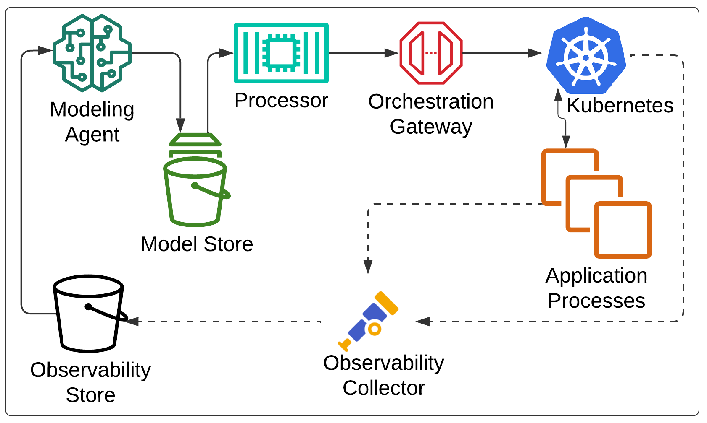

# SCALE system

## Design Overview

## Starting the system

### Minikube

See [Minikube setup](../k8s/README.md#manage-minikube-cluster)

### docker-compose

See [docker-compose docs](../docker/README.md#docker-compose)

## Viewing traces in grafana

1. Generate trace data on the test cluster
2. In your browser, navigate to <http://localhost:3000/>
3. On the left panel, select **Explore**
4. In the center panel, select **Search**test-clustertest-clusters
