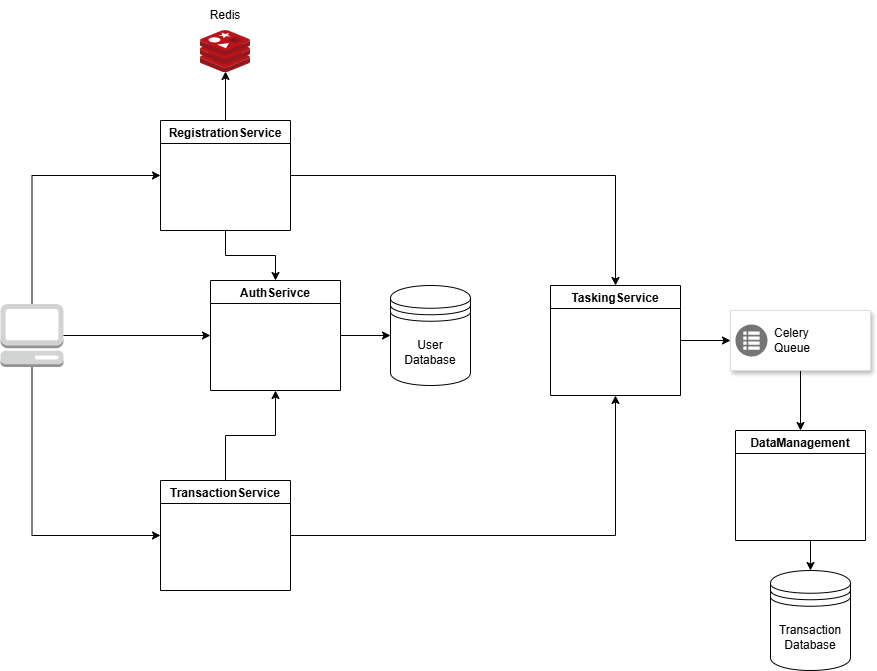

# Overview

Financial tracking and management tool.

## Components

* Backend: FastAPI (Python)
* Databases: PostgreSQL
* Task Queue: Celery with Redis
* Containerization: Docker
* Orchestration: Kubernetes with Minikube for local development, or `docker-compose`

## Diagram


## Prerequisites

* Docker: Ensure Docker is installed and running.
* Kubernetes: Minikube and kubectl is required for local Kubernetes setup.
* Python: Python 3.9 or later

## Setup
* See [Setup Doc](./docs/Setup.md)

## Service implementation
* See: 
  * [Services](./docs/Services.md#implemention)
  * [OpenAPI specs](./docs/Services.md#open-api-specs)


## Running the Backend

### Minikube
1. Ensure `minikube` is running
   ```bash
   minikube start
   ```
2. Starting the application
   ```bash
   ./k8s_manage.sh start
   ```
3. Verify all of the pods have started
   ```bash
   kubectl get pods -n cash-flow
   ```

   You should see output like the following (it may take a minute or so): 
   ```bash
    $ kubectl get pods -n cash-flow
    NAME                             READY   STATUS    RESTARTS   AGE
    auth-5fd84d4f95-cfqjq            1/1     Running   0          5m49s
    celery-worker-7c98bc497f-69tpk   1/1     Running   0          5m52s
    dms-57946db4f6-fc65b             1/1     Running   0          5m46s
    redis-6664db5d7c-wqxnx           1/1     Running   0          5m52s
    registration-677864c8bf-zs9nf    1/1     Running   0          5m43s
    tasking-5c96756555-x5hnb         1/1     Running   0          5m40s
    transaction-647c77f96f-8dzbz     1/1     Running   0          5m37s
    tx-db-dep-5cb5b7b4d6-fqqjm       1/1     Running   0          5m55s
    user-db-dep-76f5ff8cc7-h7l9l     1/1     Running   0          5m57s
   ```

--- 

### Docker Compose
```bash
# navigate to the /backend directory
docker-compose up --build
```
- this will build the containers and start the cluster
- you can use `-d` flag to run in the background, but you'll probably want the logs in the foreground for now (as I'll explain below)

At this point, your cluster is ready to go.  

---

# Interacting with the cluster

## Using the command line tool

### Installation

1. Create a python virtual env
  ```bash
  python -m venv .cli
  ```
2. Activate the environment
   Note: this will be different on windows and linux|mac
  * Windows
    ```bash
    # if using get bash, cygwin, or linux on wsl
    source .cli/Scripts/activate

    # or powershell
    .cli\Scripts\activate.ps1

    # or batch
    .cli\Scripts\activate.bat
    ```
  * Linux|Mac
    ```bash
    source .cli/bin/activate
    ```
3. Install the dependencies
   ```bash
   pip install -r cli/requirements.txt
   pip install -r backend/requirements.txt
   ```
   Note: this requirement list is pretty beefy for the `cli`.  I'll trim it down and clean it up when I get a chance
4. Install the tool
   ```bash
   # assuming you're in the cash-flow root directory
   pip install -e cli/
   ```
   This will install the executable in the .cli environment.
   The `-e` flag makes the tool editable, so you can tune it if you like without reinstalling

---

### Using the tool

There are 2 entry points - `cash` and `k8s`

* The `cash` entrypoint has commands building and deploying apis (just calls the scripts), as well as a `test` entry point that is interactive and lets you play with the system.  The `--help` command works with every subcommand, and is helpful for navigating.
  ```bash
  $ cash --help
  Usage: cash [OPTIONS] COMMAND [ARGS]...

    Main entry point for CLI.

  Options:
    --help  Show this message and exit.

  Commands:
    build    Build Docker containers and publish to Docker Hub.
    openapi  Generate OpenAPI client and server APIs for a service.
    test     Run the CLI tool.
  ```

  * The `test` subcommand
    ```bash
    $ cash test --help
    Usage: cash test [OPTIONS]

      Run the CLI tool.

    Options:
      -e, --environment TEXT  The environment the system is running on. Used for
                              cli tool configuration.
      --help                  Show this message and exit.  
    ```

    * The `-e` is either `docker` or `kube`
    

      ```bash
      $ cash test -e docker

      Please choose an option:
      1. Login
      2. Register
      3. Exit
      Enter your choice [1/2/3]:
      ```
    
    * The database will be empty at first, but users and transactions will persist, unless otherwise modified or images deleted
    * Create a user
      ```bash
      Please choose an option:
      1. Login
      2. Register
      3. Exit
      Enter your choice [1/2/3]: 2
      Enter your email: phil@aol.com
      Verify code? (y = manual, a = auto) [y/a] (y): a
      Auto-verification selected. Bypassing manual verification.
      Registration verified
      Enter your username: phil
      Enter your password:
      ┌───────── Success ─────────┐
      │ User created successfully │
      └───────────────────────────┘
      ```
      - if you want to manually enter the code, for now you can find the code in the logs. 
        ```bash
        auth-1           | INFO:     172.20.0.9:53654 - "GET /api/v1/auth/validate_user?email=steve%40gmail.com HTTP/1.1" 200 OK
        celery-worker-1  | [2024-09-20 00:33:32,636: WARNING/ForkPoolWorker-4] Sending registration code DNLJAC to steve@gmail.com       <--- Here 
        celery-worker-1  | [2024-09-20 00:33:32,637: INFO/ForkPoolWorker-4] Task tasks.send_registration_code_email[271dfb0d-9f1e-450d-bba1-a6c75dd235cd] succeeded in 0.0018697960003919434s: None
        ```

      * Now you should see something like this: 
        ```bash
        Enter the code: DNLJAC
        Verification response: valid=True
        Registration verified
        Enter your username: steve
        Enter your password:
        ┌───────── Success ─────────┐
        │ User created successfully │
        └───────────────────────────┘

        Please choose an option:
        1. Login
        2. Register
        3. Exit
        Enter your choice [1/2/3]:
        ```

      * Now you can log in a create/read transactions

      * Login
      ```bash
      Please choose an option:
      1. Login
      2. Register
      3. Exit
      Enter your choice [1/2/3]: 1
      Enter your username: phil
      Enter your password:
      ┌──── Success ─────┐
      │ Login Successful │
      └──────────────────┘
      ```

      * Create Transaction
      ```bash
      API to test:
      1. Auth
      2. Transactions
      3. Data Management
      4. Tasking
      5. Logout
      Enter your choice [1/2/3/4/5]: 2
      Testing Transactions API

      Select transaction type:
      1. Create Transaction
      2. View Transactions
      3. Exit
      Enter your choice [1/2/3]: 1
      Creating transaction...
      Enter the amount: 24.47
      Enter the category: things
      Enter the description: stuff
      Enter the date (2024-09-19T23:59:24.941283):
      ┌──────────── Success ─────────────┐
      │ Transaction created successfully │
      └──────────────────────────────────┘
      ```

      * Logs
      ```bash
      transaction-1    | INFO:     172.20.0.1:36478 - "POST /api/v1/transactions HTTP/1.1" 307 Temporary Redirect
      auth-1           | 2024-09-20 03:59:29,389 - AuthService - DEBUG - token: sub='phil' id=7
      auth-1           | INFO:     172.20.0.8:60472 - "GET /api/v1/auth/authorize HTTP/1.1" 200 OK
      transaction-1    | 2024-09-20 03:59:29,391 - TransactionService - DEBUG - Creating transaction: amount=24.47 category='things' description='stuff' date=datetime.datetime(2024, 9, 19, 23, 59, 24, 941283)
      tasking-1        | 2024-09-20 03:59:29,396 - TaskingService - DEBUG - Queuing transaction request: transaction=TransactionCreate(account_id=7, amount=24.47, category='things', description='stuff', date=datetime.datetime(2024, 9, 19, 23, 59, 24, 941283))
      celery-worker-1  | [2024-09-20 03:59:29,400: INFO/MainProcess] Task tasks.process_transaction[36959884-1823-4225-b7a8-25d2d5eb16e7] received
      dms-1            | 2024-09-20 03:59:29,407 - DataService - DEBUG - Creating transaction: account_id=7 amount=24.47 category='things' description='stuff' date=datetime.datetime(2024, 9, 19, 23, 59, 24, 941283)
      transaction-1    | 2024-09-20 03:59:29,392 - TransactionService - DEBUG - token: id=7
      tasking-1        | INFO:     172.20.0.8:45370 - "POST /internal/v1/tasks/process_transaction HTTP/1.1" 200 OK
      celery-worker-1  | [2024-09-20 03:59:29,400: DEBUG/MainProcess] TaskPool: Apply <function fast_trace_task at 0x7f65d91bd820> (args:('tasks.process_transaction', '36959884-1823-4225-b7a8-25d2d5eb16e7', {'lang': 'py', 'task': 'tasks.process_transaction', 'id': '36959884-1823-4225-b7a8-25d2d5eb16e7', 'shadow': None, 'eta': None, 'expires': None, 'group': None, 'group_index': None, 'retries': 0, 'timelimit': [None, None], 'root_id': '36959884-1823-4225-b7a8-25d2d5eb16e7', 'parent_id': None, 'argsrepr': "({'transaction': {'account_id': 7, 'amount': 24.47, 'category': 'things', 'description': 'stuff', 'date': datetime.datetime(2024, 9, 19, 23, 59, 24, 941283)}},)", 'kwargsrepr': '{}', 'origin': 'gen1@156a9ba38398', 'ignore_result': False, 'properties': {'correlation_id': '36959884-1823-4225-b7a8-25d2d5eb16e7', 'reply_to': '766d93d7-7739-364a-b9f1-75b0301c0804', 'delivery_mode': 2, 'delivery_info': {'exchange': '', 'routing_key': 'celery'}, 'priority': 0, 'body_encoding': 'base64', 'delivery_tag': 'e2c28782-2a3a-4be5-a13f-f7be516ce475'}, 'reply_to': '766d93d7-7739-364a-b9f1-75b0301c0804', 'correlation_id':... kwargs:{})
      dms-1            | 2024-09-20 03:59:29,416 - DataService - DEBUG - db transaction id: 4
      transaction-1    | 2024-09-20 03:59:29,400 - TransactionService - DEBUG - Transaction created successfully: status='success'
      celery-worker-1  | [2024-09-20 03:59:29,403: WARNING/ForkPoolWorker-4] processing transaction: {'transaction': {'account_id': 7, 'amount': 24.47, 'category': 'things', 'description': 'stuff', 'date': datetime.datetime(2024, 9, 19, 23, 59, 24, 941283)}}
      dms-1            | INFO:     172.20.0.6:47450 - "POST /internal/v1/data/transactions HTTP/1.1" 200 OK
      transaction-1    | INFO:     172.20.0.1:36478 - "POST /api/v1/transactions/ HTTP/1.1" 200 OK
      celery-worker-1  | [2024-09-20 03:59:29,403: WARNING/ForkPoolWorker-4] Calling DMS for transaction upload request: {'transaction': {'account_id': 7, 'amount': 24.47, 'category': 'things', 'description': 'stuff', 'date': datetime.datetime(2024, 9, 19, 23, 59, 24, 941283)}}
      celery-worker-1  | [2024-09-20 03:59:29,404: DEBUG/ForkPoolWorker-4] Resetting dropped connection: dms
      celery-worker-1  | [2024-09-20 03:59:29,419: DEBUG/ForkPoolWorker-4] http://dms:8080 "POST /internal/v1/data/transactions HTTP/11" 200 1
      celery-worker-1  | [2024-09-20 03:59:29,420: WARNING/ForkPoolWorker-4] DMS response: 4
      celery-worker-1  | [2024-09-20 03:59:29,421: WARNING/ForkPoolWorker-4] response type: <class 'int'>
      celery-worker-1  | [2024-09-20 03:59:29,423: INFO/ForkPoolWorker-4] Task tasks.process_transaction[36959884-1823-4225-b7a8-25d2d5eb16e7] succeeded in 0.02033317400037049s: None
      ```


      * View transactions
      ```bash
      Select transaction type:
      1. Create Transaction
      2. View Transactions
      3. Exit
      Enter your choice [1/2/3]: 2
      Viewing transactions...
      4. View all transactions
      5. View transaction by ID
      Enter your choice [1/2]: 1
                                Transactions
      ┌────────┬──────────┬─────────────┬────────────────────────────┐
      │ Amount │ Category │ Description │ Date                       │
      ├────────┼──────────┼─────────────┼────────────────────────────┤
      │ 24.47  │ things   │ stuff       │ 2024-09-19T23:59:24.941283 │
      └────────┴──────────┴─────────────┴────────────────────────────┘
      ```

      * Logs
      ```bash
      transaction-1    | INFO:     172.20.0.1:42878 - "GET /api/v1/transactions HTTP/1.1" 307 Temporary Redirect
      auth-1           | 2024-09-20 04:00:39,311 - AuthService - DEBUG - token: sub='phil' id=7
      transaction-1    | 2024-09-20 04:00:39,314 - TransactionService - DEBUG - Getting transactions with skip: 0 and limit: 10
      dms-1            | 2024-09-20 04:00:39,319 - DataService - DEBUG - Getting transactions for user_id 7 with skip: 0 and limit: 10
      auth-1           | INFO:     172.20.0.8:48908 - "GET /api/v1/auth/authorize HTTP/1.1" 200 OK
      transaction-1    | 2024-09-20 04:00:39,326 - TransactionService - DEBUG - Transactions: [TransactionBase(amount=24.47, category='things', description='stuff', date=datetime.datetime(2024, 9, 19, 23, 59, 24, 941283))]
      dms-1            | 2024-09-20 04:00:39,322 - DataService - DEBUG - Returning transactions: [<models.Transaction object at 0x7f2adff9c9a0>]
      transaction-1    | INFO:     172.20.0.1:42878 - "GET /api/v1/transactions/ HTTP/1.1" 200 OK
      dms-1            | INFO:     172.20.0.8:38172 - "GET /internal/v1/data/transactions?user_id=7&skip=0&limit=10 HTTP/1.1" 200 OK
      tx-db-1          | 2024-09-20 04:01:21.908 UTC [27] LOG:  checkpoint starting: time
      tx-db-1          | 2024-09-20 04:01:22.497 UTC [27] LOG:  checkpoint complete: wrote 6 buffers (0.0%); 0 WAL file(s) added, 0 removed, 0 recycled; write=0.513 s, sync=0.013 s, total=0.589 s; sync files=6, longest=0.009 s, average=0.003 s; distance=1 kB, estimate=1 kB; lsn=0/195B6C0, redo lsn=0/195B688
    ```

#### Using the `sim` command
The `sim` command will generate fake users, register their accounts, log them in, and generate fake transactions
```bash
$ cash sim --help
Usage: cash sim [OPTIONS]

  Simulate user activity.

Options:
  -u, --users INTEGER         The number of users to simulate.  [default: 10]
  -t, --threads INTEGER       The number of threads.  [default: 3]
  -x, --transactions INTEGER  The number of transactions to generate.
                              [default: 3]
  --help                      Show this message and exit.
```

**Example**

This will create 15 users using 5 threads, and will generate 20 transactions for each user
```bash
cash sim -u 15 -t 5 -x 20
```

You can verify the transactions and users that were created following instructions in the [Database doc](./docs/Database.md)


